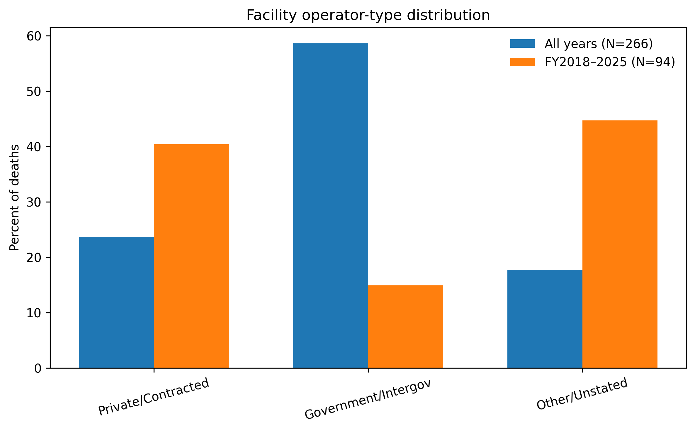
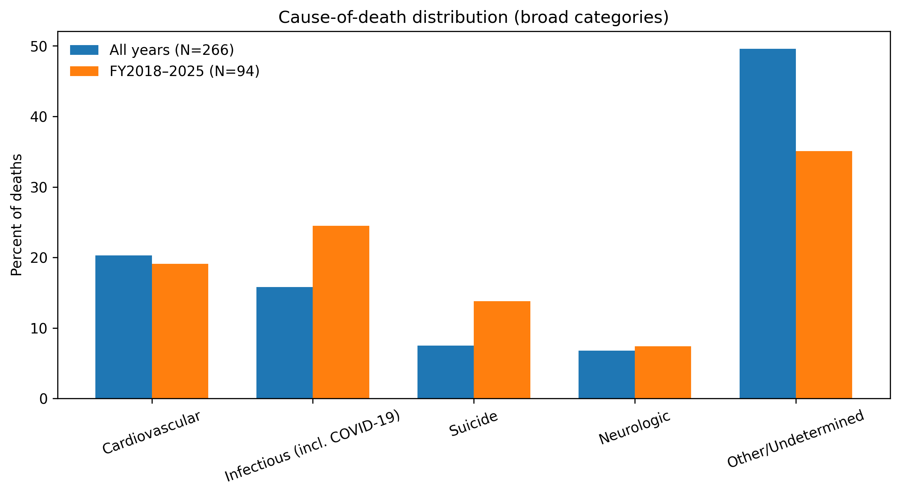
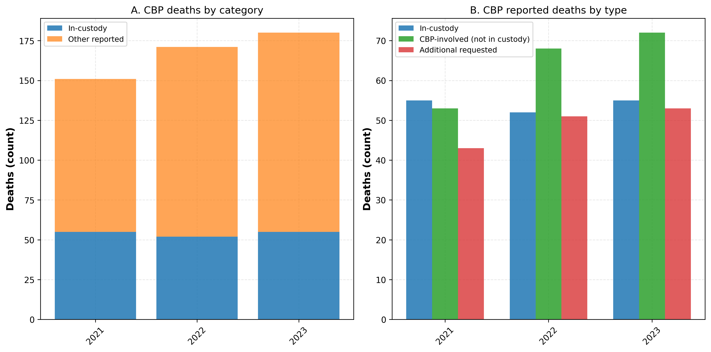

# Supplement

## Mortality in U.S. Immigration and Customs Enforcement Detention, FY2004–Jan 2026

**Authors:** Sanjay Basu, MD, PhD<sup>1</sup>*; Benjamin Huynh, PhD<sup>2</sup>; Mathew V. Kiang, ScD<sup>3</sup>; Elizabeth Chin, PhD, MPH<sup>4</sup>; Jason R. Andrews, MD, MS<sup>5</sup>

**Affiliations:**\
<sup>1</sup>Department of Medicine, University of California, San Francisco, San Francisco, CA, USA\
<sup>2</sup>Department of Epidemiology, Johns Hopkins Bloomberg School of Public Health, Baltimore, MD, USA\
<sup>3</sup>Department of Epidemiology and Population Health, Stanford University School of Medicine, Stanford, CA, USA\
<sup>4</sup>Department of Biostatistics, Johns Hopkins Bloomberg School of Public Health, Baltimore, MD, USA\
<sup>5</sup>Division of Infectious Diseases and Geographic Medicine, Department of Medicine, Stanford University School of Medicine, Stanford, CA, USA

**Corresponding Author:** Sanjay Basu, MD, PhD (sanjay.basu@ucsf.edu)

**Date:** January 2026

---

## eMethods

### Data Sources and Verification

This appendix details source documentation and reproducibility procedures for the analysis of mortality in U.S. Immigration and Customs Enforcement (ICE) detention.

**CBP data.** Beginning in FY2021, CBP’s Office of Professional Responsibility (OPR) publishes “CBP-Related Deaths” reports. These reports use a broad “CBP-related” category that includes deaths in CBP custody plus deaths in the presence of CBP (e.g., rescues, medical emergencies, environmental exposure). We analyzed FY2021–FY2023 OPR counts separately and did not pool them with ICE because fiscal-year CBP ADP is not publicly released, precluding rate estimation. Federal Deaths in Custody Reporting Program (FDCRP) statistical tables provide arrest-related and in-custody CBP deaths under a standardized federal definition for FY2016–FY2023; these counts are also provided as annual totals only. CBP’s “Death in Custody Statistics” postings list 0–6 in-custody deaths per year for FY2017–FY2022 but exclude CBP-involved events outside custody. A GAO audit (GAO‑20‑536; stored in `data/GAO report on gaps in CBP medical services.pdf`) found under-reporting to Congress (31 identified deaths along the southwest border in FY2014–FY2019 vs. 20 reported), underscoring reliability concerns. A merged case-level dataset (ACLU Texas tracker and Southern Border Communities Coalition list) contributes 624 unique CBP-related deaths (61 in-custody) for cross-referencing; it is provided for transparency but not for rate estimation because case ascertainment and inclusion windows differ. See eTable 10 for a side-by-side comparison of OPR “CBP-related” and FDCRP arrest-related/in-custody counts, and `data/cbp_deaths_merged.csv`, `data/cbp_deaths_in_custody.csv`, `data/cbp_deaths_by_year.csv`, and `data/bjs_official_counts.csv` for the underlying extracts.

### Death Records

Data on in-custody deaths were compiled from two official ICE sources:

1. Historical deaths (FY2004–2017): a 35‑page FOIA release listing all in‑custody deaths from October 1, 2003 through September 30, 2017.<sup>1</sup>
2. Recent deaths (FY2018–2025): the ICE Detainee Death Reporting webpage, which provides individual death announcements and detailed reports.<sup>2</sup>
3. Public reporting updates: calendar‑year 2025 and January 2026 deaths compiled from public reporting and linked in the per‑death index.

We extracted all records and de‑duplicated on name and date of death to construct a complete dataset of 274 unique deaths from FY2004 through January 29, 2026 (with calendar‑year 2025 and January 2026 updates). The dataset is provided in `complete_death_records.csv` and the fully detailed file in `all_274_deaths_detailed.csv` (it contains 274 rows).

**Data completeness.** Cause‑of‑death information is present for all 274 deaths. Dates of death are reconciled and complete. Age is missing for 1 death; facility location is complete for all years: FY2003–2017 values were computed from the FOIA table (date of birth and last detention location) and FY2018–2025 values were taken from individual reports.

### Average Daily Population (ADP)

Average Daily Population (ADP) is the standard denominator for custody mortality rates, representing person‑time at risk.<sup>3</sup> For each fiscal year, we sourced ADP from official ICE reports or trusted secondary sources where ICE annual series were not available. eTable 1 summarizes sources for each period.

### Data Quality Assurance

We undertook several steps to ensure data quality and accuracy. First, annual death counts from raw extractions were cross‑checked against the final analytic tables. Second, deaths were assigned to administrations by actual date of death, and assignments were programmatically verified. Third, additional 2025 deaths were identified in public reporting to complete the CY2025 series, and January 2026 deaths were cataloged through January 29, 2026; these records are linked in the per‑death index and included in the analytic dataset (32 total deaths in CY2025; 8 deaths through January 29, 2026). Fourth, for FY2003–2017, we parsed the FOIA PDF using lattice‑based table extraction (camelot) to capture all 172 rows; ages were computed from dates of birth and death, and facility locations from “location of last detention.” Fuzzy string matching reconciled spelling variants (e.g., Jiminez/Jimenez). Final completeness checks confirm no missing values across sex, facility name, facility location, facility type, cause of death, and date of death in `all_274_deaths_detailed.csv`; age is missing for 1 record.

For CBP, OPR reports provide aggregate counts only (no demographics) beginning in FY2021, while FDCRP statistical tables provide arrest‑related and in‑custody counts for FY2016–FY2023. These sources are not pooled and are presented as counts because CBP fiscal‑year ADP is not publicly released. A merged case‑level file (`cbp_deaths_merged.csv`, with a filtered `cbp_deaths_in_custody.csv`) reconciles ACLU and Southern Border Communities Coalition lists (624 unique CBP‑related deaths; 61 in‑custody) for transparency; because inclusion rules differ, these files are not used for rate estimation.

**Under‑reporting risk.** ICE public death lists omit identifiable minors, and several widely reported child deaths in custody do not appear on the ICE DDR page.<sup>4-6</sup> Post‑release deaths (including hospital releases and Alternatives to Detention) are also unobserved. CBP standardized death reporting begins in FY2021; earlier CBP deaths are not captured. These gaps likely bias in‑custody counts downward; the analytic dataset follows ICE and CBP’s public postings, and potential missing deaths are noted as a limitation.

---

### Methodological Approach

#### Study Design

We conducted a retrospective cohort study of all individuals detained in ICE custody from October 1, 2003 to January 29, 2026.

#### Administration Assignment

Deaths were assigned to administrations by date of death with periods defined as: Bush (January 20, 2001–January 19, 2009), Obama (January 20, 2009–January 19, 2017), Trump 1 (January 20, 2017–January 19, 2021), Biden (January 20, 2021–January 19, 2025), and Trump 2 (January 20, 2025–January 29, 2026). Rate analyses extend through January 29, 2026 using ICE‑reported January 2026 ADP (69,919) as a partial‑month denominator; as an average daily population for the period, this denominator is not expected to systematically underestimate person‑time.<sup>15</sup>

#### Statistical Analysis

Mortality rates were calculated per 100,000 person‑years by summing ADP within each interval. Exact Poisson methods were used for 95% confidence intervals. Poisson regression produced rate ratios and two‑sided Wald p‑values comparing administrations, with Biden as the reference. Analyses used Python 3.11 (pandas, numpy, scipy).

---

### Sensitivity Analyses

We conducted four pre‑specified sensitivity analyses:

1. 2025 denominator uncertainty: recalculated Trump 2 rates using the TRAC January 12, 2025 census (ADP = 39,703) and by excluding 2025 entirely.
2. Excluding COVID‑19 deaths: removed deaths with COVID‑19 listed as proximate or contributory cause to test pandemic‑specific influence.
3. High/low denominator bounds: bounded rates using the lowest observed ADP (20,152; FY2021) and the highest (51,130; CY2025).
4. Facility‑type distribution (descriptive): summarized facility‑type counts; person‑time by facility type is not publicly reported, precluding facility‑specific rates.

---

### Descriptive Tables and Audit Notes

Summary tables and audit notes are presented in eTables 2-5: age and sex by administration; mortality‑rate sensitivity scenarios; facility‑type counts; and FOIA name reconciliation examples.

---

### STROBE Checklist

The full STROBE checklist is provided as eTable 13.

---

## Reproducibility Instructions

Repository: https://github.com/sanjaybasu/ice-detention-mortality

Environment

- Python 3.11 recommended (3.10–3.12 compatible)
- Dependencies: `pandas`, `numpy`, `scipy`, `matplotlib`, `requests` (see `replication_code/requirements.txt`)

Setup

```
python -m venv .venv
source .venv/bin/activate  # Windows: .venv\\Scripts\\activate
pip install -r notebooks/ice_deaths/replication_code/requirements.txt
```

Reproduction steps

1. Compute rates: `python notebooks/ice_deaths/replication_code/02_calculate_mortality_rates.py`
2. Generate figures: `python notebooks/ice_deaths/replication_code/03_generate_figures.py`
3. Verify/download ICE PDFs: `python notebooks/ice_deaths/replication_code/04_verify_and_download_pdfs.py`
4. Build per‑death index: `python notebooks/ice_deaths/replication_code/05_generate_appendix_a9.py`
5. Audit DDR causes (FY2018–2025): `python notebooks/ice_deaths/replication_code/06_audit_causes.py`
6. FOIA consistency (FY2003–2017): `python notebooks/ice_deaths/replication_code/07_verify_foia_consistency.py`
7. Supplement figures (operator & causes): `python notebooks/ice_deaths/replication_code/08_generate_appendix_figures.py`
8. CBP figures (counts only): generated via `03_generate_figures.py` using `data/cbp_deaths_summary.csv` (FY2021–FY2023 OPR reports)

Outputs

- Figures: repository `manuscript/Figure*.png` (Figure 2 has three panels: ADP, deaths, and mortality rates, starting at FY2004; 2025 uses calendar-year deaths and the CY2025 ADP; calendar-year ADP is not publicly reported for all prior years, so fiscal-year ADP averages are used for earlier denominators)
- CBP counts figure: `manuscript/Appendix_Figure_A3.png` (eFigure 3; counts only; ADP not publicly released at fiscal-year level)
- Table 1 data: derived from ICE and TRAC public reports (see eTable 1); the generated table is included in the repository’s data outputs
- Verification logs: repository `verification/` (PDF checks, cause audit, FOIA crosswalk)
- Supplement figures: `manuscript/Appendix_Figure_A1_operator.png`, `manuscript/Appendix_Figure_A2_cause.png` (eFigures 1-2)
- CBP source documents: OPR “CBP-Related Deaths” reports for FY2021–FY2023 (see data/cbp_deaths_summary.csv for counts extracted)

Denominator (2025–Jan 2026)

- TRAC daily series (see eTable 1, TRAC report): CY mean (≈51,130) used in base case; FY mean (≈48,984) and Jan‑12 snapshot (39,703) included in sensitivity (eTable 3).
- ICE FY2026 detention statistics: January 2026 ICE Average Daily Population (ADP = 69,919) used as a partial‑month denominator through January 29, 2026.

---

## eTables and eFigures

### eTable 1. Sources for Average Daily Population (ADP) by fiscal year

| Fiscal Year(s) | Source | URL | Notes |
| :------------- | :----- | :-- | :---- |
| 2001–2006 | Migration Policy Institute | https://www.migrationpolicy.org/research/immigration-enforcement-united-states-rise-formidable-machinery | Table 1, page 14 of “Immigration Enforcement in the United States: The Rise of a Formidable Machinery.” |
| 2007–2009 | ICE Total Removals Report | https://www.ice.gov/doclib/about/offices/ero/pdf/ice-removals-2009.pdf | Extracted from historical annual reports. |
| 2010–2024 | ICE Enforcement and Removal Operations Reports | https://www.ice.gov/statistics | Annual ICE statistical reports. |
| 2025 | TRAC Immigration | https://tracreports.org/reports/753/ | ICE has not published FY2025 ADP; analyses use the TRAC CY2025 daily-series average (≈51,130) with sensitivity at the FY2025 mean (≈48,984) and the Jan 12 snapshot (39,703). |
| 2026 (Jan 1–29) | US Immigration and Customs Enforcement | https://www.ice.gov/doclib/detention/FY26_detentionStats01082026.xlsx | January 2026 ICE ADP (69,919) from FY2026 detention statistics updated January 8, 2026; used as a partial‑month denominator. |

Legend. ADP sources used to compute person‑years for mortality estimates by fiscal year and administration.

### eTable 2. Age and sex by administration

| Administration | N deaths | Median age | Mean age | Range | Male | Female |
| :------------- | -------: | ---------: | -------: | :---- | ---: | -----: |
| Bush | 99 | 47 | 45.5 | 21–81 | 91 | 8 |
| Obama | 67 | 46 | 43.3 | 19–72 | 57 | 10 |
| Trump 1 | 42 | 46.5 | 46.6 | 21–74 | 40 | 2 |
| Biden | 26 | 39.5 | 42.5 | 23–61 | 24 | 2 |
| Trump 2 | 40 | 44 | 46.2 | 25–75 | 38 | 2 |

Legend. Age statistics were computed from dates of birth and death; age is missing for 1 death in Trump 2. Sex counts derive from ICE reports and the FOIA table.

### eTable 3. Mortality‑rate sensitivity scenarios (per 100,000 person‑years)

| Scenario | Bush | Obama | Trump 1 | Biden | Trump 2 |
| :------- | ---: | ----: | ------: | ----: | ------: |
| Base (TRAC CY2025 ADP ≈ 51,130 + Jan 2026 ADP = 69,919) | 79.17 | 24.99 | 26.54 | 23.35 | 70.57 |
| Exclude 2025 | 79.17 | 24.99 | 26.54 | 20.66 | — |
| FY2025 ADP ≈ 48,984 (TRAC) + Jan 2026 ADP | 79.17 | 24.99 | 26.54 | 23.35 | 73.34 |
| Jan 12, 2025 snapshot (ADP = 39,703) + Jan 2026 ADP | 79.17 | 24.99 | 26.54 | 23.35 | 88.38 |
| Excluding COVID‑19 deaths | 79.17 | 24.99 | 21.49 | 20.66 | 70.57 |

Legend. Rates recomputed under alternative denominators and removing COVID‑19‑attributed deaths. Relative administration patterns are robust.

### eTable 4. Facility‑type counts (all years)

| Facility type | Count |
| :------------ | ----: |
| IGSA | 55 |
| Contract | 43 |
| DIGSA | 37 |
| BOP | 24 |
| Not stated | 32 |
| USMS IGA | 17 |
| SPC | 16 |
| CDF | 14 |
| Hospital | 11 |
| USMS CDF | 6 |
| ICE‑operated | 7 |
| HOLD | 3 |
| STAGING | 1 |

Legend. Counts are derived from ICE FOIA and individual death reports. Person‑time by facility type is not available; facility‑specific rates cannot be computed.

### eTable 5. FOIA name reconciliation examples

| Analytic dataset (compact form) | FOIA table (canonical form) |
| :------------------------------ | :-------------------------- |
| LINDE‑CERRO ALBERTO | LINDE‑CEPERO, ALBERTO |
| LEYVA‑ARIONA ANGELIO | LEYVA‑ARJONA, ARGELIO |
| LOPEZ‑HERNANDEZ JOSE MANUEL | AZURDIA‑HERNANDEZ, JOSE MANUEL |
| SAENGSIRI Nongkran | SAENGSIRI, Thongchay |
| GONZALEZ‑Gasiba Omar Epifanio | GONZALEZ‑Gadba, Osmar Epifanio |
| JIMENEZ‑Joseph Juan Carlos Llanoso | JIMINEZ‑Joseph, Jean Carlos Alfonso |

Legend. Examples of spelling harmonization for exact matching between FOIA entries and the analytic dataset.

### eTable 6. Facilities with the highest number of deaths (all years)

| Facility name | Deaths |
| :------------ | -----: |
| Eloy Federal Contract Facility (AZ) | 16 |
| Stewart Detention Center (GA) | 12 |
| Columbia Care Center (SC) | 9 |
| Houston Contract Detention Facility (TX) | 8 |
| Jena/LaSalle Detention Facility (LA) | 6 |
| Otay Mesa Detention Center (CA) | 6 |
| Springfield Federal Medical Center (MO) | 6 |
| Adelanto Correctional Facility (CA) | 6 |
| San Pedro Service Processing Center (CA) | 4 |
| Oakdale Federal Detention Center (LA) | 4 |
| York County Prison (PA) | 4 |
| Hampton Roads Regional Jail (VA) | 4 |

Legend. Facilities with the largest number of deaths across all years. Counts reflect events rather than rates; facility‑specific person‑time is not available.

### eTable 7. Cause-of-death distribution, FY2004–Jan 2026 (N = 274)

| Category | Count | Percent |
| :------- | ----: | ------: |
| Cardiovascular | 56 | 20.4 |
| Infectious (incl. COVID-19) | 42 | 15.3 |
| Neurologic | 18 | 6.6 |
| Suicide | 23 | 8.4 |
| Other/Undetermined | 135 | 49.3 |

Legend. Broad categories are assigned using a conservative keyword approach applied to the cause-of-death text in official ICE sources (FOIA table and individual death reports). Categories are mutually exclusive and may reflect preliminary or final determinations in recent reports.

### eTable 8. Cause-of-death distribution, FY2018–FY2026 (N = 102)

| Category | Count | Percent |
| :------- | ----: | ------: |
| Cardiovascular | 20 | 19.6 |
| Infectious (incl. COVID-19) | 23 | 22.5 |
| Neurologic | 7 | 6.9 |
| Suicide | 16 | 15.7 |
| Other/Undetermined | 36 | 35.3 |

Legend. Distribution among deaths with individual ICE reports and public reporting updates (FY2018–FY2026). Category definitions follow eTable 7.

### eTable 9. Facility operator-type distribution (all years and FY2018–FY2026)

| Operator type | All years (N=274) | Percent | FY2018–FY2026 (N=102) | Percent |
| :------------ | -----------------: | ------: | --------------------: | ------: |
| Private/Contracted | 63 | 23.0 | 38 | 37.3 |
| Government/Intergov | 156 | 56.9 | 14 | 13.7 |
| Other/Unstated | 55 | 20.1 | 50 | 49.0 |

Legend. Operator-type groups are derived from facility categories reported by ICE: Private/Contracted includes Contract, CDF, and USMS CDF; Government/Intergov includes SPC/ICE-operated, IGSA/DIGSA, BOP, and USMS IGA; Other/Unstated includes Hospital, HOLD, STAGING, and Not stated. These are descriptive counts; person‑time by operator is not publicly available, so operator‑specific mortality rates cannot be computed.

### eTable 10. CBP deaths by fiscal year and source/definition (FY2016–FY2023)

| Fiscal year | FDCRP arrest-related deaths | FDCRP in-custody deaths | FDCRP total | OPR “CBP-related” deaths | OPR in-custody deaths | Notes |
| :---------- | --------------------------: | ----------------------: | ----------: | -----------------------: | --------------------: | :---- |
| FY2016 | 10 | 0 | 10 | — | — | OPR report not published |
| FY2017 | 4 | 3 | 7 | — | — | OPR report not published |
| FY2018 | 8 | 2 | 10 | — | — | OPR report not published |
| FY2019 | 25 | 0 | 25 | — | — | OPR report not published |
| FY2020 | 17 | 2 | 19 | — | — | OPR report not published |
| FY2021 | 48 | 1 | 49 | 151 | 55 | First OPR “CBP-related deaths” report |
| FY2022 | 44 | 0 | 44 | 171 | 52 | OPR counts include CBP-involved and “additional requested” |
| FY2023 | 48 | 0 | 48 | 180 | 55 | OPR counts include CBP-involved and “additional requested” |

Legend. Federal Deaths in Custody Reporting Program (FDCRP) tables count arrest-related deaths (including use of force, pursuits, transport, and temporary holding) and in-custody deaths under a standardized federal definition. OPR “CBP-related deaths” are broader and include deaths in the presence of CBP personnel (e.g., rescues, environmental exposure, medical emergencies) as well as in-custody deaths; OPR series begin in FY2021. Fiscal-year CBP ADP is not publicly released, so results are presented as counts and not pooled with ICE.

### eTable 11. Data dictionary for `all_274_deaths_detailed.csv`

| Column | Definition |
| :----- | :--------- |
| Name | Detainee full name (as reported). |
| Sex | Sex as reported in the FOIA table or individual report. |
| Age | Age at death in years, computed from date of birth and date of death when available. |
| Country | Country of citizenship. |
| Date_of_Death | Date of death (YYYY‑MM‑DD). |
| Cause_of_Death | Cause of death as reported; “undetermined/pending” when preliminary or not stated. |
| Facility_Name | Name of last detention facility or facility associated with the death. |
| Facility_Location | City/state or descriptor for facility location. |
| Facility_Type | Facility category (e.g., IGSA, CDF, DIGSA, SPC, BOP, etc.). |
| PDF_URL | Primary official source URL for the death (FOIA list or individual report). |
| Period | FY2003–2017 (FOIA table), FY2018–2025 (individual reports), or public reporting updates (CY2025 and January 2026). |

Legend. Column definitions for the primary analytic dataset used for all tabulations and figures.

### eTable 12. Per-death primary-source URL index

This table lists every death (N = 274) with key details and the primary official source URL.

| Name | Sex | Age | Country | Date of Death | Facility | Location | Type | Cause of Death | Source URL |
| :--- | :-- | --: | :------ | :------------ | :------ | :------- | :--- | :------------- | :--------- |
| VERDECIA-CARRILLO HERIBERTO | Male | 40 | CUBA | 2003-10-07 | Atwater US Penitentiary CA | Atwater US Penitentiary, CA | BOP | Acute Thrombotic Occlusion Left Descending Coronary Artery | https://www.ice.gov/doclib/foia/reports/detaineedeaths-2003-2017.pdf |
| JORRIN-MILLER DANIEL | Male | 52 | CUBA | 2003-11-04 | San Pedro Service Processing Center CA | San Pedro Service Processing Center, CA | SPC | Hypertensive Cardiovascular Disease | https://www.ice.gov/doclib/foia/reports/detaineedeaths-2003-2017.pdf |
| LINDE-CERRO ALBERTO | Male | 63 | CUBA | 2003-12-20 | Columbia Care Center SC | Columbia Care  Center, SC | HOSPITAL | Brain Tumor Glioblastoma | https://www.ice.gov/doclib/foia/reports/detaineedeaths-2003-2017.pdf |
| LEYVA-ARIONA ANGELIO | Male | 50 | CUBA | 2004-01-05 | Terre Haute US Penitentiary IN | Terre Haute US  Penitentiary, IN | BOP | Asphyxia | https://www.ice.gov/doclib/foia/reports/detaineedeaths-2003-2017.pdf |
| GUTIERREZ RAMIRO | Male | 37 | MEXICO | 2004-01-17 | Sacramento County Jail CA | Sacramento County Jail, CA | USMS IGA | Upper Gastrointestinal Tract Bleed | https://www.ice.gov/doclib/foia/reports/detaineedeaths-2003-2017.pdf |
| POPOOLA ADETUNJI | Male | 48 | NIGERIA | 2004-02-02 | Dallas County Jail TX | Dallas County Jail, TX | IGSA | Cardia Arrhythmia | https://www.ice.gov/doclib/foia/reports/detaineedeaths-2003-2017.pdf |
| RIOZ-MARTINEZ CEZAR | Male | 25 | MEXICO | 2004-02-13 | Prio County Jail TX | Frio County Jail, TX | IGSA | Asphyxia | https://www.ice.gov/doclib/foia/reports/detaineedeaths-2003-2017.pdf |
| MOSLEY HECTOR | Male | 57 | PANAMA | 2004-02-27 | Columbia Care Center SC | Columbia Care Center, SC | HOSPITAL | AIDS | https://www.ice.gov/doclib/foia/reports/detaineedeaths-2003-2017.pdf |
| HERNANDEZ WILFREDO | Male | 65 | CUBA | 2004-03-03 | Columbia Care Center SC | Columbia Care  Center, SC | HOSPITAL | Coronary Artery Disease | https://www.ice.gov/doclib/foia/reports/detaineedeaths-2003-2017.pdf |
| RODRIGUEZ JOSE RANGEL | Male | 32 | GUATEMALA | 2004-03-03 | Kern County Jail Lerdo CA | Kern County Jail (Lerdo), CA | IGSA | Histoplasmosis Sepsis | https://www.ice.gov/doclib/foia/reports/detaineedeaths-2003-2017.pdf |
| SOLIS-PEREZ MARIA | Female | 44 | EL SALVADOR | 2004-03-06 | Jefferson County Jail TX | Jefferson County Jail, TX | IGSA | Subarachnoid Hemorrhage due to Ruptured Berry Aneurysm | https://www.ice.gov/doclib/foia/reports/detaineedeaths-2003-2017.pdf |
| ALVAREZ-ARIAS JOSE DE LA CONCEPCION | Male | 46 | CUBA | 2004-03-10 | Allenwood Low Security Federal Correctional Institute PA | Allenwood Low Security Federal Correctional Institute, PA | BOP | Metastic Renal Clear Cell Carcinoma | https://www.ice.gov/doclib/foia/reports/detaineedeaths-2003-2017.pdf |
| PEREZ-AYALA MANUEL | Male | 54 | CUBA | 2004-03-14 | Rochester Federal Medical Center MN | Rochester Federal Medical Center, MN | BOP | Sudden Cardiac Death | https://www.ice.gov/doclib/foia/reports/detaineedeaths-2003-2017.pdf |
| MENDEZ-BACCA CARLOS | Male | 29 | HONDURAS | 2004-03-19 | Guadalupe City Jail TX | Guadalupe City Jail, TX | IGSA | AIDS | https://www.ice.gov/doclib/foia/reports/detaineedeaths-2003-2017.pdf |
| SATKUNES-WARAN KANDIAH | Male | 39 | SRI LANKA | 2004-04-17 | Middlesex County Jail NJ | Middlesex County Jail, NJ | IGSA | Natural Causes | https://www.ice.gov/doclib/foia/reports/detaineedeaths-2003-2017.pdf |
| FANKEU SAMOU | Male | 37 | CAMEROON | 2004-05-11 | INS Airport Hold KY | INS Airport Hold, IL | HOLD | AIDS | https://www.ice.gov/doclib/foia/reports/detaineedeaths-2003-2017.pdf |
| FIGUEREDO-LOPEZ JUAN | Male | 45 | CUBA | 2004-05-29 | Springfield Federal Medical Center MO | Springfield Federal Medical Center, MO | BOP | Acute Pulmonary Embolis | https://www.ice.gov/doclib/foia/reports/detaineedeaths-2003-2017.pdf |
| RUST RICHARD | Male | 34 | JAMAICA | 2004-05-29 | Oakdale Federal Detention Center LA | Oakdale Federal Detention Center, LA | BOP | Cardiac Arrythmia | https://www.ice.gov/doclib/foia/reports/detaineedeaths-2003-2017.pdf |
| MENDEZ ENRIQUE | Male | 70 | MEXICO | 2004-06-14 | El Centro Service Processing Center CA | EL Centro Service Processing Center, CA | SPC | Metastic Carcinoma of Prostate Gland | https://www.ice.gov/doclib/foia/reports/detaineedeaths-2003-2017.pdf |
| HERRERA-TERAN JOSE | Male | 71 | CUBA | 2004-06-15 | Pike County Correctional Facility PA | Pike County  Correctional  Facility, PA | IGSA | Myocardial Infarction | https://www.ice.gov/doclib/foia/reports/detaineedeaths-2003-2017.pdf |
| MARTINEZ JOSE ALBERTO | Male | 47 | DOMINICAN REPUBLIC | 2004-07-28 | Hampton Roads Regional Jail VA | Hampton Roads Regional Jail, VA | USMS IGA | Sepsis | https://www.ice.gov/doclib/foia/reports/detaineedeaths-2003-2017.pdf |
| ALONSO JUAN | Male | 73 | GUATEMALA | 2004-08-01 | Columbia Care Center SC | Columbia Care Center, SC | HOSPITAL | Renal Failure | https://www.ice.gov/doclib/foia/reports/detaineedeaths-2003-2017.pdf |
| ENRIQUEZ-BETANCOURT N | Male | 55 | CUBA | 2004-08-21 | Etowah County Jail AL | Etowah County Jail, AL | USMS IGA | Arteriosclerotic Heart Disease | https://www.ice.gov/doclib/foia/reports/detaineedeaths-2003-2017.pdf |
| MEJIA-VICENTES SEBASTIAN | Male | 27 | MEXICO | 2004-08-22 | Hampton Roads Regional Jail VA | Hampton Roads Regional Jail, VA | USMS IGA | Asphyxia | https://www.ice.gov/doclib/foia/reports/detaineedeaths-2003-2017.pdf |
| SOCA-ROS OTILIO | Male | 22 | CUBA | 2004-08-23 | Krome North Service Processing Center FL | Krome North  Service Processing  Center, FL | SPC | Hypertensive Cardiovascular Disease | https://www.ice.gov/doclib/foia/reports/detaineedeaths-2003-2017.pdf |
| SINGH BHUPINDER | Male | 48 | INDIA | 2004-09-21 | Columbia Care Center SC | Columbia Care Center, SC | HOSPITAL | End Stage Renal Disease | https://www.ice.gov/doclib/foia/reports/detaineedeaths-2003-2017.pdf |
| AYALA-GARCIA ANTONIO | Male | 67 | CUBA | 2004-09-24 | Springfield Federal Medical Center MO | Springfield Federal Medical Center, MO | BOP | Renal Failure | https://www.ice.gov/doclib/foia/reports/detaineedeaths-2003-2017.pdf |
| RUIZ-TABARES ERVIN | Male | 24 | COLOMBIA | 2004-09-25 | Guaynabo Metropolitan Detention Center PR | Guaynabo Metropolitan Detention Center, PR | BOP | Asphyxia | https://www.ice.gov/doclib/foia/reports/detaineedeaths-2003-2017.pdf |
| REYES-ALTIMIRANO SIMON | Male | 25 | HONDURAS | 2004-10-12 | El Paso Service Processing Center TX | El Paso Service Processing Center, TX | SPC | Brain Tumor | https://www.ice.gov/doclib/foia/reports/detaineedeaths-2003-2017.pdf |
| LOPEZ-LARA JOSE | Male | 56 | MEXICO | 2004-10-24 | Eloy Federal Contract Facility AZ | Eloy Federal Contract Facility, AZ | DIGSA | Cerebral Infarct | https://www.ice.gov/doclib/foia/reports/detaineedeaths-2003-2017.pdf |
| ZAROU JOSE | Male | 56 | ARGENTINA | 2004-11-01 | Wicomico County Detention Center MD | Wicomico County Detention Center, MD | IGSA | Cardiac Tamponade | https://www.ice.gov/doclib/foia/reports/detaineedeaths-2003-2017.pdf |
| BANTICA JOSEPH | Male | 81 | HAITI | 2004-11-04 | Krome North Service Processing Center FL | Krome North  Service Processing  Center, FL | SPC | Acute and Chronic Pancreatitis | https://www.ice.gov/doclib/foia/reports/detaineedeaths-2003-2017.pdf |
| FILS-AIME YVEL | Male | 48 | HAITI | 2004-11-22 | Hampton Roads Regional Jail VA | Hampton Roads Regional Jail, VA | USMS IGA | Drowning | https://www.ice.gov/doclib/foia/reports/detaineedeaths-2003-2017.pdf |
| ANACHE-CAMPOS LUIS | Male | 47 | CUBA | 2004-11-30 | Devens Federal Medical Center MA | Devens Federal Medical Center, MA | BOP | Cardiac Arrest | https://www.ice.gov/doclib/foia/reports/detaineedeaths-2003-2017.pdf |
| HERRERA-LIMAS PEDRO | Male | 32 | CUBA | 2004-12-15 | York County Prison PA | York County Prison, PA | IGSA | Carcinoma of Lung | https://www.ice.gov/doclib/foia/reports/detaineedeaths-2003-2017.pdf |
| SARABIA-VALLASENOR IGNACIO | Male | 32 | MEXICO | 2005-01-04 | Otay Mesa Detention Center CA | Otay Mesa Detention Center, CA | USMS CDF | Cardiac Arrest | https://www.ice.gov/doclib/foia/reports/detaineedeaths-2003-2017.pdf |
| LOPEZ-RUELAS ELIAS | Male | 54 | MEXICO | 2005-01-04 | Eloy Federal Contract Facility AZ | Eloy Federal Contract Facility, AZ | DIGSA | Cirrhosis of Unclear Etiology | https://www.ice.gov/doclib/foia/reports/detaineedeaths-2003-2017.pdf |
| ROSELL-SIERRA JOSE | Male | 71 | CUBA | 2005-01-08 | Forth Worth Federal Medical Center TX | Forth Worth Federal Medical Center, TX | BOP | Pneumonia | https://www.ice.gov/doclib/foia/reports/detaineedeaths-2003-2017.pdf |
| CORREOSO-JAY CONRADO | Male | 63 | CUBA | 2005-01-31 | Florence US Penitentiary CO | Florence US Penitentiary, CO | BOP | Complications of Metastic Prostate Cancer | https://www.ice.gov/doclib/foia/reports/detaineedeaths-2003-2017.pdf |
| NAND MAYA (AKA NAND MAYA) | Female | 56 | FIJI | 2005-02-02 | Eloy Federal Contract Facility AZ | Eloy Federal  Contract Facility,  AZ | DIGSA | Cardiac Arrest | https://www.ice.gov/doclib/foia/reports/detaineedeaths-2003-2017.pdf |
| HEO SUNG SOO | Male | 51 | KOREA | 2005-02-16 | Passaic County Jail NJ | Passaic County Jail, NJ | IGSA | Asphyxia | https://www.ice.gov/doclib/foia/reports/detaineedeaths-2003-2017.pdf |
| BELBACHIR HASSIBA | Female | 27 | ALGERIA | 2005-03-17 | McHenry County Correctional Facility IL | McHenry County Correctional Facility, IL | USMS IGA | Asphyxia | https://www.ice.gov/doclib/foia/reports/detaineedeaths-2003-2017.pdf |
| LAZO-REINOSO SILVIO | Male | 50 | CUBA | 2005-04-07 | Springfield Federal Medical Center MO | Springfield Federal Medical Center, MO | BOP | Pancreatic Cancer | https://www.ice.gov/doclib/foia/reports/detaineedeaths-2003-2017.pdf |
| TUNON-ABEAL JOSE | Male | 53 | CUBA | 2005-05-21 | Tensas Parish Detention Center LA | Tensas Parish  Detention Center,  LA | IGSA | Acute Renal Failure | https://www.ice.gov/doclib/foia/reports/detaineedeaths-2003-2017.pdf |
| VARGAS NHUNG | Female | 36 | VIETNAM | 2005-06-08 | Harris County Jail GA | Harris County Jail, GA | IGSA | Cardiac Arrest | https://www.ice.gov/doclib/foia/reports/detaineedeaths-2003-2017.pdf |
| CRUZ-GARCIA RENE | Male | 53 | CUBA | 2005-06-11 | Butner Federal Correctional Institute NC | Butner Federal Correctional Institute, NC | BOP | Non-Small Cell Lung Cancer | https://www.ice.gov/doclib/foia/reports/detaineedeaths-2003-2017.pdf |
| ALVAREZ-ESQUIVEL WALTER | Male | 46 | GUATEMALA | 2005-07-06 | Laredo Processing Center TX | Laredo Processing Center, TX | USMS IGA | Acute Hemorrhagic Cerebral Vascular Accident | https://www.ice.gov/doclib/foia/reports/detaineedeaths-2003-2017.pdf |
| AHMAD TANVEER | Male | 43 | PAKISTAN | 2005-09-09 | Monmouth County Correctional Institute NJ | Monmouth County Correctional Institute, NJ | IGSA | Occlusive Coronary Atherosclerosis | https://www.ice.gov/doclib/foia/reports/detaineedeaths-2003-2017.pdf |
| DELAPAZ EDUARDO | Male | 69 | MEXICO | 2005-09-27 | Columbia Care Center SC | Columbia Care Center, SC | HOSPITAL | Acute Cerebral Vascular Accident | https://www.ice.gov/doclib/foia/reports/detaineedeaths-2003-2017.pdf |
| PRADO-ARENCILIA REINALDO | Male | 37 | CUBA | 2005-10-03 | Houston Contract Detention Facility TX | Houston Contract Detention Facility, TX | CDF | Seizure Disorder of Unknown Etiology | https://www.ice.gov/doclib/foia/reports/detaineedeaths-2003-2017.pdf |
| SANCHEZ-RODRIGUEZ SERGIO | Male | 54 | CUBA | 2005-10-30 | Butner Federal Correctional Institute NC | Butner Federal Correctional Institute, NC | BOP | Metastic Carcinoma of Lung | https://www.ice.gov/doclib/foia/reports/detaineedeaths-2003-2017.pdf |
| MARRERO-ABREO DOMINGO | Male | 62 | CUBA | 2005-11-15 | San Pedro Service Processing Center CA | San Pedro Service Processing Center, CA | SPC | Acute Myocardial Infarction | https://www.ice.gov/doclib/foia/reports/detaineedeaths-2003-2017.pdf |
| LEDESMAN-GUERREO ROBERTO | Male | 72 | MEXICO | 2005-12-02 | Otay Mesa Detention Center CA | Otay Mesa Detention Center, CA | USMS CDF | Cardiopulmonary Arrest | https://www.ice.gov/doclib/foia/reports/detaineedeaths-2003-2017.pdf |
| SALAZAR-GOMEZ JUAN | Male | 29 | MEXICO | 2005-12-14 | Eloy Federal Contract Facility AZ | Eloy Federal  Contract Facility,  AZ | DIGSA | Asphyxia | https://www.ice.gov/doclib/foia/reports/detaineedeaths-2003-2017.pdf |
| KENLEY-SANDRA MARINA | Female | 52 | BARBADOS | 2005-12-18 | Hampton Roads Regional Jail VA | Hampton Roads Regional Jail, VA | USMS IGA | Hypertensive Cardiovascular Disease | https://www.ice.gov/doclib/foia/reports/detaineedeaths-2003-2017.pdf |
| MURPHY VINCENT | Male | 59 | JAMAICA | 2006-02-04 | Suffolk County House of Corrections MA | Suffolk County House of Corrections, MA | IGSA | Hypertensive Cardiovascular Disease | https://www.ice.gov/doclib/foia/reports/detaineedeaths-2003-2017.pdf |
| GARCIA-SANCHEZ FELIPE | Male | 21 | COLOMBIA | 2006-02-13 | Oakdale Federal Detention Center LA | Oakdale Federal Detention Center, LA | BOP | Asphyxia | https://www.ice.gov/doclib/foia/reports/detaineedeaths-2003-2017.pdf |
| GARCIA-MEJIA GEOVANNY | Male | 27 | HONDURAS | 2006-03-18 | Newton County Correctional Center TX | Newton County Correctional Center, TX | IGSA | Asphyxia | https://www.ice.gov/doclib/foia/reports/detaineedeaths-2003-2017.pdf |
| POLANCO-MOLINA ANGEL | Male | 53 | CUBA | 2006-03-30 | Springfield Federal Medical Center MO | Springfield Federal Medical Center, MO | BOP | Pulmonary Embolus and Cardiac Arrest | https://www.ice.gov/doclib/foia/reports/detaineedeaths-2003-2017.pdf |
| INAMAQUA-MERCHA MARIA | Female | 30 | ECUADOR | 2006-04-04 | Ramsey County Adult Detention Center MN | Ramsey County  Adult Detention  Center, MN | USMS IGA | Neurocysticercosis | https://www.ice.gov/doclib/foia/reports/detaineedeaths-2003-2017.pdf |
| RODRIGUEZ-CASTRO WALTER | Male | 28 | EL SALVADOR | 2006-04-23 | Kern County Jail CA | Kern County Jail (Lerdo), CA | IGSA | Cryptococcal Meningitis | https://www.ice.gov/doclib/foia/reports/detaineedeaths-2003-2017.pdf |
| RODRIGUEZ-GONZALEZ MIGUEL | Male | 76 | MEXICO | 2006-05-21 | San Pedro Service Processing Center CA | San Pedro Service Processing Center, CA | SPC | Sequelae of Chronic Renal Failure | https://www.ice.gov/doclib/foia/reports/detaineedeaths-2003-2017.pdf |
| LAZANO-BLANCO JORGE | Male | 51 | CUBA | 2006-06-03 | Springfield Federal Medical Center MO | Springfield Federal Medical Center, MO | BOP | Severe Emphysema | https://www.ice.gov/doclib/foia/reports/detaineedeaths-2003-2017.pdf |
| OSMAN YUSIF | Male | 34 | GHANA | 2006-06-27 | Otay Mesa Detention Center CA | Otay Mesa Detention Center, CA | USMS CDF | Coronary Artery Vasculitis | https://www.ice.gov/doclib/foia/reports/detaineedeaths-2003-2017.pdf |
| CASTRO-JIMENEZ RENE | Male | 66 | CUBA | 2006-08-15 | Devens Federal Medical Center MA | Devens Federal  Medical Center,  MA | BOP | Coronary Artery Athersclerosis | https://www.ice.gov/doclib/foia/reports/detaineedeaths-2003-2017.pdf |
| KIM YOUNG SOOK | Female | 57 | KOREA | 2006-09-11 | Bernalillo County Detention Center NM | Bernalillo County Detention Center, NM | DIGSA | Widely Metastatic Pancreatic Cancer | https://www.ice.gov/doclib/foia/reports/detaineedeaths-2003-2017.pdf |
| SINGH JAMER | Male | 40 | INDIA | 2006-09-20 | Kern County Jail Lerdo CA | Kern County Jail (Lerdo), CA | IGSA | Severe Atherosclerotic Heart Disease | https://www.ice.gov/doclib/foia/reports/detaineedeaths-2003-2017.pdf |
| LOPEZ-GREGORIO JOSE | Male | 32 | GUATEMALA | 2006-09-29 | Eloy Federal Contract Facility AZ | Eloy Federal Contract Facility, AZ | DIGSA | Asphyxia | https://www.ice.gov/doclib/foia/reports/detaineedeaths-2003-2017.pdf |
| CARLOS-CORTEZ RAUDEL | Male | 22 | MEXICO | 2006-10-03 | Mira Loma Detention Center CA | Mira Loma Detention Center, CA | DIGSA | Asphyxia | https://www.ice.gov/doclib/foia/reports/detaineedeaths-2003-2017.pdf |
| MARTINEZ-RIVAS ANTONIO | Male | 44 | MEXICO | 2006-10-04 | Houston Contract Detention Facility TX | Houston Contract Detention Facility, TX | CDF | Asphyxia | https://www.ice.gov/doclib/foia/reports/detaineedeaths-2003-2017.pdf |
| CERVANTES-CORONA JESUS | Male | 42 | MEXICO | 2006-11-19 | Northwest Detention Center WA | Northwest Detention Center, WA | CDF | Atherosclerotic Coronary Artery Disease | https://www.ice.gov/doclib/foia/reports/detaineedeaths-2003-2017.pdf |
| ABDFULAYE SALL | Male | 50 | GUINEA | 2006-12-02 | Piedmont Regional Jail VA | Piedmont  Regional Jail, VA | IGSA | Hemoperitoneum due to spontaneous rupture of right renal vein | https://www.ice.gov/doclib/foia/reports/detaineedeaths-2003-2017.pdf |
| CHAVEZ-TORRES MARIO | Male | 27 | COLOMBIA | 2006-12-13 | Eloy Federal Contract Facility AZ | Eloy Federal  Contract Facility,  AZ | DIGSA | Ruptured Arteriovenous Malformation Midbrain | https://www.ice.gov/doclib/foia/reports/detaineedeaths-2003-2017.pdf |
| RODRIGUEZ-TORRES FELIX | Male | 36 | ECUADOR | 2007-01-18 | Eloy Federal Contract Facility AZ | Eloy Federal Contract Facility, AZ | DIGSA | Germ Cell Tumor with Metastasis | https://www.ice.gov/doclib/foia/reports/detaineedeaths-2003-2017.pdf |
| ROMERO NERY | Male | 22 | EL SALVADOR | 2007-02-12 | Bergen County Jail NJ | Bergen County Jail, NJ | USMS IGA | Asphyxia | https://www.ice.gov/doclib/foia/reports/detaineedeaths-2003-2017.pdf |
| BAH BOUBACAR | Male | 52 | GUINEA | 2007-05-30 | Elizabeth Contract Detention Facility NJ | Elizabeth Contract Detention Facility, NJ | CDF | Traumatic Brain Injury | https://www.ice.gov/doclib/foia/reports/detaineedeaths-2003-2017.pdf |
| ABELLANO VICTOR | Male | 23 | MEXICO | 2007-07-20 | San Pedro Service Processing Center CA | San Pedro Service  Processing  Center, CA | SPC | Sepsis/Acquired Immune Deficiency Syndrome | https://www.ice.gov/doclib/foia/reports/detaineedeaths-2003-2017.pdf |
| DE ARAUJO EDIMAR | Male | 34 | BRAZIL | 2007-08-07 | North Las Vegas NV | North Las Vegas, NV | USMS IGA | Acute Intoxication due to the Combined Effects of Cocaine and Hydroxyzine | https://www.ice.gov/doclib/foia/reports/detaineedeaths-2003-2017.pdf |
| CONTRERAS-DOMINGUEZ ROSA ISELA | Female | 35 | MEXICO | 2007-08-09 | El Paso Service Processing Center TX | El Paso Service Processing Center, TX | SPC | Pulmonary Thromboembolism | https://www.ice.gov/doclib/foia/reports/detaineedeaths-2003-2017.pdf |
| GUEVARA-LAZARO ALEJANDRO | Male | 21 | MEXICO | 2007-08-13 | El Paso Service Processing Center TX | El Paso Service Processing Center, TX | SPC | Ruptured Berry Aneurysm of the Right Middle Cerebral Artery | https://www.ice.gov/doclib/foia/reports/detaineedeaths-2003-2017.pdf |
| GONZALEZ_BAEZ CESAR | Male | 35 | MEXICO | 2007-12-05 | Mira Loma Detention Center CA | Mira Loma Detention Center, CA | DIGSA | Electrocution | https://www.ice.gov/doclib/foia/reports/detaineedeaths-2003-2017.pdf |
| GUMAYAGAY PEDRO | Male | 50 | PHILIPPINES | 2008-01-23 | Stewart Detention Center (GA) | Stewart Detention Center, GA | DIGSA | Metastic Adenocarcinoma of Lung | https://www.ice.gov/doclib/foia/reports/detaineedeaths-2003-2017.pdf |
| DIAZ-SALGADO ALEJANDRO | Male | 48 | CUBA | 2008-02-03 | South Louisiana Detention Center LA | South Louisiana Detention Center, LA | IGSA | Multi-System Organ Failure | https://www.ice.gov/doclib/foia/reports/detaineedeaths-2003-2017.pdf |
| SUARES-ALMENARES ARTURO | Male | 72 | CUBA | 2008-03-03 | Middlesex County Jail NJ | Middlesex County Jail, NJ | IGSA | Hypertensive and arteriosclerotic cardiovascular disease with CHF and severe pulmonary edema | https://www.ice.gov/doclib/foia/reports/detaineedeaths-2003-2017.pdf |
| DURIGEL-PAEZ LUIS | Male | 60 | CUBA | 2008-05-14 | Rolling Plains Detention Center TX | Rolling Plains  Detention Center,  TX | IGSA | Hypertension and Athersclerotic Heart Disease | https://www.ice.gov/doclib/foia/reports/detaineedeaths-2003-2017.pdf |
| JOSEPH VALERY | Male | 23 | HAITI | 2008-06-20 | Glades County Detention Center FL | Glades County Detention Center, FL | IGSA | Seizure Disorder | https://www.ice.gov/doclib/foia/reports/detaineedeaths-2003-2017.pdf |
| VALASQUEZ AMBROCIO | Male | 42 | GUATEMALA | 2008-06-27 | Perry County Correctional Center AL | Perry County Correctional Center, AL | IGSA | Cardiopulmonary Arrest | https://www.ice.gov/doclib/foia/reports/detaineedeaths-2003-2017.pdf |
| CANALES-BACA ROGELIO | Male | 36 | HONDURAS | 2008-07-08 | Pinal County Jail AZ | Pinal County Jail,  AZ | IGSA | Asphyxia | https://www.ice.gov/doclib/foia/reports/detaineedeaths-2003-2017.pdf |
| DAWOOD NAIL YOUISEF | Male | 41 | IRAQ | 2008-07-21 | Eloy Federal Contract Facility AZ | Eloy Federal  Contract Facility,  AZ | DIGSA | Coronary Artery Vasculitis | https://www.ice.gov/doclib/foia/reports/detaineedeaths-2003-2017.pdf |
| NG HIU LUI | Male | 34 | CHINA | 2008-08-06 | Wyatt Detention Center RI | Wyatt Detention Center, RI | IGSA | Complications of Metastatic Hepatocellular CA | https://www.ice.gov/doclib/foia/reports/detaineedeaths-2003-2017.pdf |
| BARNETT EDWIN | Male | 58 | JAMAICA | 2008-08-12 | Lemuel Shattuck Hospital MA | Lemuel Shattuck Hospital, MA | HOSPITAL | Sequelae of Chronic Renal Failure (on dialysis) | https://www.ice.gov/doclib/foia/reports/detaineedeaths-2003-2017.pdf |
| OWUSU EMMANUEL | Male | 62 | GHANA | 2008-10-06 | Eloy Federal Contract Facility AZ | Eloy Federal Contract Facility, AZ | DIGSA | Suicide by Hanging | https://www.ice.gov/doclib/foia/reports/detaineedeaths-2003-2017.pdf |
| BAIRES JUAN | Male | 26 | EL SALVADOR | 2008-11-12 | Kern County Jail Lerdo CA | Kern County Jail (Lerdo), CA | IGSA | Self-Sustained Head Injuries | https://www.ice.gov/doclib/foia/reports/detaineedeaths-2003-2017.pdf |
| SANTOS-MAIDIQUE ALBERTO | Male | 60 | CUBA | 2008-11-18 | Springfield Federal Medical Center MO | Springfield  Federal Medical  Center, MO | BOP | Electrocution | https://www.ice.gov/doclib/foia/reports/detaineedeaths-2003-2017.pdf |
| SAYLAB HADAYATULLAH | Male | 58 | AFGHANISTAN | 2008-11-24 | Otero County Processing Center NM | Otero County Processing Center, NM | DIGSA | Lung Cancer | https://www.ice.gov/doclib/foia/reports/detaineedeaths-2003-2017.pdf |
| NEWBOROUGH GUIDO | Male | 48 | GERMANY | 2008-11-28 | Piedmont Regional Jail VA | Piedmont Regional Jail, VA | IGSA | Meningitis/HIV/ Pneumonia | https://www.ice.gov/doclib/foia/reports/detaineedeaths-2003-2017.pdf |
| ALVAREZ GOMEZ JOSE | Male | 29 | HONDURAS | 2008-12-27 | Jena/LaSalle Detention Facility LA | Jena/LaSalle Detention Facility, LA | DIGSA | Seizure | https://www.ice.gov/doclib/foia/reports/detaineedeaths-2003-2017.pdf |
| MARTINEZ JULIO | Male | 52 | MEXICO | 2009-01-04 | Otay Mesa Detention Center CA | Otay Mesa Detention Center, CA | USMS CDF | Lymphatic Cancer | https://www.ice.gov/doclib/foia/reports/detaineedeaths-2003-2017.pdf |
| CORONADO-GABRIEL CLAUDIO | Male | 29 | GUATEMALA | 2009-01-12 | Jena/LaSalle Detention Facility LA | Jena/LaSalle Detention Facility, LA | DIGSA | Acute Cerebral Vascular Incident | https://www.ice.gov/doclib/foia/reports/detaineedeaths-2003-2017.pdf |
| JIMENEZ-ROJAS SERGIO | Male | 24 | MEXICO | 2009-02-07 | Tensas Parish Detention Center LA | Tensas Parish  Detention Center,  LA | IGSA | HIV Complications | https://www.ice.gov/doclib/foia/reports/detaineedeaths-2003-2017.pdf |
| MARTINEZ-MEDINA ROBERTO | Male | 39 | MEXICO | 2009-03-11 | Stewart Detention Center (GA) | Stewart Detention Center, GA | DIGSA | Cardiac Arrest | https://www.ice.gov/doclib/foia/reports/detaineedeaths-2003-2017.pdf |
| CRUZ-SILVA ARNOLDO | Male | 53 | CUBA | 2009-05-10 | Port Isabel Detention Center TX | Port Isabel Detention Center, TX | SPC | Cardiac Arrest | https://www.ice.gov/doclib/foia/reports/detaineedeaths-2003-2017.pdf |
| STOIKA VERA | Female | 56 | CZECH REPUBLIC | 2009-07-24 | Columbia Care Center SC | Columbia Care  Center, SC | HOSPITAL | Liver Cancer | https://www.ice.gov/doclib/foia/reports/detaineedeaths-2003-2017.pdf |
| NEGUSSE HULUF | Male | 24 | ETHIOPIA | 2009-08-14 | Wakulla County Jail FL | Wakulla County Jail, FL | IGSA | Cardiac Arrest | https://www.ice.gov/doclib/foia/reports/detaineedeaths-2003-2017.pdf |
| JIMON TINIGUARDO ROLANDO | Male | 19 | GUATEMALA | 2009-09-30 | Columbia Care Center SC | Columbia Care Center, SC | HOSPITAL | Diabetes Complications | https://www.ice.gov/doclib/foia/reports/detaineedeaths-2003-2017.pdf |
| TAVAREZ PEDRO JUAN | Male | 49 | DOMINICAN REPUBLIC | 2009-10-19 | Suffolk County House of Corrections MA | Suffolk County House of Corrections, MA | IGSA | Heart Failure | https://www.ice.gov/doclib/foia/reports/detaineedeaths-2003-2017.pdf |
| PADILLA-PEREZ SEBASTIAN | Male | 71 | CUBA | 2009-11-21 | York County Prison PA | York County Prison, PA | IGSA | Leukemia | https://www.ice.gov/doclib/foia/reports/detaineedeaths-2003-2017.pdf |
| GOMEZ-VASQUEZ ERNESTO | Male | 30 | GUATEMALA | 2010-03-05 | Mira Loma Detention Center CA | Mira Loma Detention Center, CA | DIGSA | Multiple Conditions | https://www.ice.gov/doclib/foia/reports/detaineedeaths-2003-2017.pdf |
| OBEY EVELYN | Female | 36 | LIBERIA | 2010-03-12 | York County Prison PA | York County Prison, PA | IGSA | Cancer | https://www.ice.gov/doclib/foia/reports/detaineedeaths-2003-2017.pdf |
| RODRIGUEZ-SOLIS ARNULFO | Male | 62 | GUATEMALA | 2010-03-13 | Oakdale Federal Detention Center LA | Oakdale Federal Detention Center, LA | BOP | Pneumonia Complications | https://www.ice.gov/doclib/foia/reports/detaineedeaths-2003-2017.pdf |
| COGLE-DEL PINO JULIAN | Male | 72 | CUBA | 2010-05-07 | Butner Federal Correctional Institute NC | Butner Federal Correctional Institute, NC | BOP | Cancer | https://www.ice.gov/doclib/foia/reports/detaineedeaths-2003-2017.pdf |
| HOLDYWIENKO KAZIMIERZ | Male | 54 | POLAND | 2010-06-16 | Columbia Care Center SC | Columbia Care  Center, SC | HOSPITAL | Cancer | https://www.ice.gov/doclib/foia/reports/detaineedeaths-2003-2017.pdf |
| REYES-ZALAYA JOSE NELSON | Male | 28 | EL SALVADOR | 2010-07-17 | Orleans Parish Sheriff LA | Orleans Parish Sheriff, LA | IGSA | Cancer | https://www.ice.gov/doclib/foia/reports/detaineedeaths-2003-2017.pdf |
| HERNANDEZ-GOMEZ JOSE ANTONIO | Male | 66 | MEXICO | 2010-11-05 | Broadview Service Staging IL | Broadview Service Staging, IL | STAGING | Liver Failure | https://www.ice.gov/doclib/foia/reports/detaineedeaths-2003-2017.pdf |
| STERLING JOHN | Male | 54 | JAMAICA | 2010-11-06 | Oakdale Federal Detention Center LA | Oakdale Federal Detention Center, LA | BOP | Sepsis | https://www.ice.gov/doclib/foia/reports/detaineedeaths-2003-2017.pdf |
| SEGUNDO JOSE MANUEL | Male | 41 | PANAMA | 2010-12-23 | Krome North Service Processing Center FL | Krome North Service Processing Center, FL | SPC | Blood Cancer | https://www.ice.gov/doclib/foia/reports/detaineedeaths-2003-2017.pdf |
| PALOMO-RODRIGUEZ JUAN | Male | 30 | MEXICO | 2011-01-13 | Houston Contract Detention Facility TX | Houston Contract  Detention Facility,  TX | CDF | Acute Coronary Disease | https://www.ice.gov/doclib/foia/reports/detaineedeaths-2003-2017.pdf |
| AGUILAR-ESPINOZA JOSE | Male | 55 | HONDURAS | 2011-01-31 | Theo Lacy Facility CA | Theo Lacy Facility, CA | IGSA | Natural Causes | https://www.ice.gov/doclib/foia/reports/detaineedeaths-2003-2017.pdf |
| GUO QI GEN | Male | 47 | CHINA | 2011-02-23 | Clinton County Correctional Facility PA | Clinton County Correctional Facility, PA | USMS IGA | Asphyxia - Suicide | https://www.ice.gov/doclib/foia/reports/detaineedeaths-2003-2017.pdf |
| MILITIC AMRA | Female | 47 | BOSNIA | 2011-03-20 | Weber County Jail UT | Weber County  Jail, UT | USMS IGA | Chronic colitis/ Atrial fibrillation | https://www.ice.gov/doclib/foia/reports/detaineedeaths-2003-2017.pdf |
| HERNANDEZ MIGUEL ANGEL | Male | 54 | EL SALVADOR | 2011-06-28 | North Georgia Detention Center GA | North Georgia Detention Center, GA | IGSA | Heart attack | https://www.ice.gov/doclib/foia/reports/detaineedeaths-2003-2017.pdf |
| BAMENGA IRENE | Female | 29 | ANGOLA | 2011-07-27 | Albany County Jail NY | Albany County Jail, NY | USMS IGA | Cardiomyopathy | https://www.ice.gov/doclib/foia/reports/detaineedeaths-2003-2017.pdf |
| RAMIREZ-REYES VICTOR | Male | 56 | ECUADOR | 2011-09-26 | Elizabeth Contract Detention Facility NJ | Elizabeth Contract  Detention Facility,  NJ | CDF | Hypertensive and atherosclerotic cardiovascular disease | https://www.ice.gov/doclib/foia/reports/detaineedeaths-2003-2017.pdf |
| RAMIREZ-RAMIREZ ANIBAL | Male | 35 | EL SALVADOR | 2011-10-02 | Immigration Centers of America Farmville VA | Immigration Centers of America Farmville, VA | DIGSA | Liver Failure | https://www.ice.gov/doclib/foia/reports/detaineedeaths-2003-2017.pdf |
| RIVERA-ROMERO MAURO | Male | 43 | EL SALVADOR | 2011-10-05 | El Paso SPC Processing Center TX | El Paso Service Processing Center, TX | SPC | HIV complications (presumed) | https://www.ice.gov/doclib/foia/reports/detaineedeaths-2003-2017.pdf |
| GRACIDA-CONTE PABLO | Male | 54 | MEXICO | 2011-10-30 | Eloy Federal Contract Facility AZ | Eloy Federal Contract Facility, AZ | DIGSA | Congestive Heart Failure | https://www.ice.gov/doclib/foia/reports/detaineedeaths-2003-2017.pdf |
| ROJAS-MARTINEZ RICARDO | Male | 53 | MEXICO | 2011-12-19 | Houston Contract Detention Facility TX | Houston Contract Detention Facility, TX | CDF | Heart Attack | https://www.ice.gov/doclib/foia/reports/detaineedeaths-2003-2017.pdf |
| SARABIA-ORTEGA MIGUEL ANGEL | Male | 36 | MEXICO | 2012-01-17 | Las Vegas Hold Room NV | Las Vegas Hold Room, NV | HOLD | Methemphetamine Intoxication | https://www.ice.gov/doclib/foia/reports/detaineedeaths-2003-2017.pdf |
| DOMINGUEZ-YALMA FERNANDO | Male | 58 | MEXICO | 2012-03-04 | Adelanto Correctional Facility CA | Adelanto  Correctional  Facility, CA | DIGSA | Pneumonia | https://www.ice.gov/doclib/foia/reports/detaineedeaths-2003-2017.pdf |
| MANDZA EVALIN-ALI | Male | 46 | GABON | 2012-04-12 | Denver Contract Detention Facility CO | Denver Contract Detention Facility, CO | CDF | Myocardial Infarction Severe Left Main Coronary Artery Stenosis | https://www.ice.gov/doclib/foia/reports/detaineedeaths-2003-2017.pdf |
| FLORES-SEGURA JUAN PABLO | Male | 31 | MEXICO | 2012-05-30 | San Bernardino Hold Room CA | San Bernadino Hold Room, CA | HOLD | Cardian Arrest | https://www.ice.gov/doclib/foia/reports/detaineedeaths-2003-2017.pdf |
| COTA-DOMINGO MANUEL | Male | 34 | GUATEMALA | 2012-12-23 | Eloy Federal Contract Facility AZ | Eloy Federal Contract Facility, AZ | DIGSA | Diabetes | https://www.ice.gov/doclib/foia/reports/detaineedeaths-2003-2017.pdf |
| ORTIZ-MATAMOROS PABLO | Male | 25 | HONDURAS | 2013-02-08 | Eloy Federal Contract Facility AZ | Joe Corley Detention Facility, TX | IGSA | Shock | https://www.ice.gov/doclib/foia/reports/detaineedeaths-2003-2017.pdf |
| SMITH GLASTON | Male | 51 | BRITISH VIRGIN ISLANDS | 2013-04-04 | Guaynabo Metropolitan Detention Center PR | Guaynabo  Metropolitan  Detention Center,  PR | BOP | Pending | https://www.ice.gov/doclib/foia/reports/detaineedeaths-2003-2017.pdf |
| TOMANEK OLDRICH | Male | 51 | CZECH REPUBLIC | 2013-04-25 | Rolling Plains Detention Center TX | Rolling Plains Detention Center, TX | IGSA | Bilateral pulmonary thromboemboeli | https://www.ice.gov/doclib/foia/reports/detaineedeaths-2003-2017.pdf |
| GUADALUPE-GONZALES ELSA | Female | 24 | GUATEMALA | 2013-04-28 | Eloy Federal Contract Facility AZ | Eloy Federal Contract Facility, AZ | DIGSA | Suicide by Hanging | https://www.ice.gov/doclib/foia/reports/detaineedeaths-2003-2017.pdf |
| GARCIA-MALDONADO JORGE | Male | 40 | GUATEMALA | 2013-04-30 | Eloy Federal Contract Facility AZ | Eloy Federal  Contract Facility,  AZ | DIGSA | Suicide by Hanging | https://www.ice.gov/doclib/foia/reports/detaineedeaths-2003-2017.pdf |
| MENA-HERNANDEZ FERNANDO | Male | 28 | GUATEMALA | 2013-06-11 | Brooks County Detention Center TX | Brooks County  Detention Center,  TX | USMS IGA | Rabies | https://www.ice.gov/doclib/foia/reports/detaineedeaths-2003-2017.pdf |
| RODRIGUEZ LESLIS | Male | 50 | HONDURAS | 2013-07-31 | Port Isabel Detention Center TX | Port Isabel Detention Center, TX | SPC | Natural Causes | https://www.ice.gov/doclib/foia/reports/detaineedeaths-2003-2017.pdf |
| MFINDA CLEMENTE NTANGOLA | Male | 27 | MOZAMBIQUE | 2013-09-02 | Houston Contract Detention Facility TX | Houston Contract  Detention Facility,  TX | CDF | Undetermined | https://www.ice.gov/doclib/foia/reports/detaineedeaths-2003-2017.pdf |
| CARLOS TIOMBE KIMANA | Female | 34 | ANTIGUA-BARBUDA | 2013-10-23 | York County Prison PA | York County Prison, PA | IGSA | Suicide by Hanging | https://www.ice.gov/doclib/foia/reports/detaineedeaths-2003-2017.pdf |
| BELL MARJORIE ANNMARIE | Female | 48 | JAMAICA | 2014-02-13 | Otay Mesa Detention Center CA | Otay Mesa Detention Center, CA | USMS CDF | Sudden Cardiac Death | https://www.ice.gov/doclib/foia/reports/detaineedeaths-2003-2017.pdf |
| ROCKWELL PETER GEORGE CARLYSLE | Male | 46 | CANADA | 2014-02-22 | Houston Contract Detention Facility TX | Houston Contract Detention Facility, TX | CDF | Hypertensive Cardiovascular Disease | https://www.ice.gov/doclib/foia/reports/detaineedeaths-2003-2017.pdf |
| HERNANDEZ-VALENCIA JOSE JAVIER | Male | 44 | MEXICO | 2014-04-12 | Houston Contract Detention Facility TX | Houston Contract Detention Facility, TX | CDF | Complications of disseminated pulmonary tuberculosis | https://www.ice.gov/doclib/foia/reports/detaineedeaths-2003-2017.pdf |
| SIERRA-SANCHEZ SANTIAGO | Male | 38 | MEXICO | 2014-07-12 | Utah County Jail UT | Utah County Jail, UT | IGSA | Staphylococcus aureus infection | https://www.ice.gov/doclib/foia/reports/detaineedeaths-2003-2017.pdf |
| GARCIA-HUEZO WELMER ALBERTO | Male | 24 | EL SALVADOR | 2014-08-03 | Rio Grande Detention Center TX | Rio Grande  Detention Center,  TX | USMS IGA | Natural Causes | https://www.ice.gov/doclib/foia/reports/detaineedeaths-2003-2017.pdf |
| UMANA-MARTINEZ JORGE ALBERTO | Male | 47 | EL SALVADOR | 2014-10-30 | South Texas Detention Complex TX | South Texas Detention Complex, TX | CDF | Sepsis | https://www.ice.gov/doclib/foia/reports/detaineedeaths-2003-2017.pdf |
| MORALES-RAMOS RAUL ERNESTO | Male | 44 | EL SALVADOR | 2015-04-06 | Adelanto Correctional Facility CA | Adelanto Correctional Facility, CA | DIGSA | Pending | https://www.ice.gov/doclib/foia/reports/detaineedeaths-2003-2017.pdf |
| FUNEZ-OCHOA CARLOS | Male | 30 | HONDURAS | 2015-04-23 | Port Isabel Detention Center TX | Port Isabel Detention Center, TX | SPC | Pending | https://www.ice.gov/doclib/foia/reports/detaineedeaths-2003-2017.pdf |
| DENIZ-SAHAGUN JOSE DE JESUS | Male | 31 | MEXICO | 2015-05-20 | Eloy Federal Contract Facility AZ | Eloy Federal Contract Facility, AZ | DIGSA | Suicide by Asphyxia | https://www.ice.gov/doclib/foia/reports/detaineedeaths-2003-2017.pdf |
| NAVARRETE-QUINTANA MARCOS | Male | 37 | MEXICO | 2015-06-18 | El Paso County Criminal Justice Center CO | El Paso County  Criminal Justice  Center, CO | IGSA | Cirrhosis of the liver | https://www.ice.gov/doclib/foia/reports/detaineedeaths-2003-2017.pdf |
| NGUYEN NHO THI | Female | 61 | VIETNAM | 2015-07-02 | Houston Contract Detention Facility TX | Houston Contract Detention Facility, TX | CDF | Ruptured cerebral artery aneurysm | https://www.ice.gov/doclib/foia/reports/detaineedeaths-2003-2017.pdf |
| GARCIA-HERNANDEZ JUAN | Male | 39 | MEXICO | 2015-09-14 | Florence Servicing Processing Center AZ | Florence Servicing  Processing  Center, AZ | SPC | Pending | https://www.ice.gov/doclib/foia/reports/detaineedeaths-2003-2017.pdf |
| LOPEZ-HERNANDEZ JOSE MANUEL | Male | 54 | GUATEMALA | 2015-12-23 | Adelanto Correctional Facility CA | Adelanto  Correctional  Facility, CA | DIGSA | Myocardial Infarction | https://www.ice.gov/doclib/foia/reports/detaineedeaths-2003-2017.pdf |
| BANEGAS-GUZMAN SAUL ENRIQUE | Male | 46 | HONDURAS | 2016-01-22 | Jena/LaSalle Detention Facility LA | Jena/LaSalle Detention Facility, LA | DIGSA | Myocardial Infarction | https://www.ice.gov/doclib/foia/reports/detaineedeaths-2003-2017.pdf |
| SAENGSIRI Thongchay | Male | 65 | LAOS | 2016-03-17 | Jena/LaSalle Detention Facility LA | Jena/LaSalle  Detention Facility,  LA | DIGSA | Hypertensive atherosclerotic cardiovascular disease with contribution of Emphysema (COPD) and obesity | https://www.ice.gov/doclib/foia/reports/detaineedeaths-2003-2017.pdf |
| BARCENAS-Padilla Rafael | Male | 50 | MEXICO | 2016-04-07 | Otero County Processing Center NM | Otero County Processing Center, NM | DIGSA | Diffuse Alveolar Damage due to Bronchopneumonia | https://www.ice.gov/doclib/foia/reports/detaineedeaths-2003-2017.pdf |
| Leonardo LEMUS-Rajo Jose | Male | 23 | EL SALVADOR | 2016-04-28 | Columbia Kendal Hospital FL | Columbia Kendal Hospital, FL | HOSPITAL | Acute Alcohol Withdrawal Syndrome due to Chronic Ethanoism | https://www.ice.gov/doclib/foia/reports/detaineedeaths-2003-2017.pdf |
| ZYAZIN Igor | Male | 46 | RUSSIA | 2016-05-01 | Otay Mesa Detention Center CA | Otay Mesa Detention Center, CA | USMS CDF | Hypertensive and Atherosclerotic Cardiovascular Disease | https://www.ice.gov/doclib/foia/reports/detaineedeaths-2003-2017.pdf |
| BOCH-Paniagua Juan Luis | Male | 36 | GUATEMALA | 2016-06-01 | Jena/LaSalle Detention Facility LA | Jena/LaSalle Detention Facility, LA | DIGSA | GI hemorrhages and cirrhosis of the liver as well as emphysema and granulomas in the lungs consistent with tuberculosis | https://www.ice.gov/doclib/foia/reports/detaineedeaths-2003-2017.pdf |
| Fino Martinez Luis Alonso | Male | 54 | HONDURAS | 2016-06-13 | Essex County Correctional Facility NJ | Essex County Correctional Facility, NJ | IGSA | Congestive Heart Failure/Cardiovascular Disease | https://www.ice.gov/doclib/foia/reports/detaineedeaths-2003-2017.pdf |
| CARELA Santo | Male | 60 | DOMINICAN REPUBLIC | 2016-07-28 | Orange County Jail NY | Orange County Jail, NY | IGSA | Pending | https://www.ice.gov/doclib/foia/reports/detaineedeaths-2003-2017.pdf |
| TINO-Lopez Moises | Male | 23 | GUATEMALA | 2016-09-27 | Hall County Department of Corrections NE | Hall County Department of Corrections, NE | IGSA | Anoxic Brain Injury due to Cardiac Arrest due to Seizure | https://www.ice.gov/doclib/foia/reports/detaineedeaths-2003-2017.pdf |
| JOSHUA-Toyin Olubunmi | Female | 54 | UNITED KINGDOM | 2016-10-24 | Rolling Plains Detention Center TX | Rolling Plains Detention Center, TX | IGSA | Complications of Cardiovascular Disease | https://www.ice.gov/doclib/foia/reports/detaineedeaths-2003-2017.pdf |
| CAMPOS Wenceslau Esmerio | Male | 49 | BRAZIL | 2016-11-25 | South Texas Detention Complex TX | South Texas  Detention  Complex, TX | CDF | Complications of Myocardial Infarction w/Cardiovascular Disease | https://www.ice.gov/doclib/foia/reports/detaineedeaths-2003-2017.pdf |
| CALDERON-De Hildago Raquel | Female | 36 | GUATEMALA | 2016-11-27 | Eloy Federal Contract Facility AZ | Eloy Federal Contract Facility, AZ | DIGSA | Natural Causes | https://www.ice.gov/doclib/foia/reports/detaineedeaths-2003-2017.pdf |
| RAYSON Roger | Male | 47 | JAMAICA | 2017-03-13 | Jena/LaSalle Detention Facility LA | Jena/LaSalle Detention Facility, LA | DIGSA | Pending | https://www.ice.gov/doclib/foia/reports/detaineedeaths-2003-2017.pdf |
| GONZALEZ-Gasiba Omar Epifanio | Male | 32 | NICARAGUA | 2017-03-28 | Adelanto Correctional Facility CA | Adelanto  Correctional  Facility, CA | DIGSA | Hypoxic Encephalopathy due to hanging | https://www.ice.gov/doclib/foia/reports/detaineedeaths-2003-2017.pdf |
| LOPEZ Sergio Alonso | Male | 55 | MEXICO | 2017-04-13 | Adelanto Correctional Facility CA | Adelanto Correctional Facility, CA | DIGSA | Hepatorenal Syndrome from End Stage Renal Disease Developed Shock | https://www.ice.gov/doclib/foia/reports/detaineedeaths-2003-2017.pdf |
| JIMENEZ-Joseph Juan Carlos Llanoso | Male | 27 | PANAMA | 2017-05-15 | Stewart Detention Center (GA) | Stewart Detention  Center, GA | DIGSA | Pending | https://www.ice.gov/doclib/foia/reports/detaineedeaths-2003-2017.pdf |
| PATEL Atulkumar Babubhai | Male | 58 | INDIA | 2017-05-16 | Atlanta City Detention Center GA | Atlanta City Detention Center, GA | USMS IGA | Pending | https://www.ice.gov/doclib/foia/reports/detaineedeaths-2003-2017.pdf |
| CACERES-Maradiaga Vicente | Male | 46 | HONDURAS | 2017-05-31 | Adelanto Correctional Facility CA | Adelanto Correctional Facility, CA | DIGSA | Pending | https://www.ice.gov/doclib/foia/reports/detaineedeaths-2003-2017.pdf |
| Mirimanian, Gourgen | Male | 54 | Armenia | 2018-04-10 | Prairieland Detention Center | Alvarado, TX | Contract | Hypertensive and atherosclerotic cardiovascular disease (natural) | https://www.ice.gov/doclib/foia/reports/ddrMirimanianGourgen.pdf |
| Romero, Ronal Francisco (aka Cruz, Ronald) | Male | 39 | Honduras | 2018-05-16 | Port Isabel Detention Center (PIDC) | Los Fresnos, Texas | Contract | Meningitis, clinical history of diabetic ketoacidosis, clinical history of sepsis | https://www.ice.gov/doclib/foia/reports/ddrRomeroRonalFranciscoAkaCruzRonald.pdf |
| Hernandez, Jeffry (aka Hernandez, Roxana) | Male | 33 | Honduras | 2018-05-25 | Lovelace Medical Center (LMC) | Albuquerque, NM | Not stated | Cardiopulmonary arrest due to complications from HIV, septic shock, anemia, dehydration, and T-cell lymphoma. | https://www.ice.gov/doclib/foia/reports/ddrHernandezJeffryAkaHernandezRoxana.pdf |
| Tran, Huy Chi | Male | 47 | Vietnam | 2018-06-12 | Eloy Detention Center (EDC) | Eloy, Arizona | Contract | Coronary artery disease | https://www.ice.gov/doclib/foia/reports/ddrTranHuyChi.pdf |
| De La Rosa, Efrain Romero | Male | 40 | Mexico | 2018-07-10 | Stewart Detention Center (GA) | Lumpkin, GA | Contract | Suicide by hanging | https://www.ice.gov/doclib/foia/reports/ddrDeLaRosaEfrainRomero.pdf |
| Ramirez-Arreola, Augustina | Female | 62 | Mexico | 2018-07-26 | Otay Mesa Detention Center (OMDC) | San Diego, CA | Contract | Cardiac arrhythmia and cardiogenic shock following aortic valve replacement surgery, with rheumatic heart disease, coronary artery disease, pneumonia, and tuberculosis as contributing factors. | https://www.ice.gov/doclib/foia/reports/ddrAugustinaRamirezArreola.pdf |
| Padron, Wilfredo | Male | 58 | Cuba | 2018-11-01 | Monroe County Detention Center (MCDC) | Key West, Florida | IGSA | Thrombosis of the right coronary artery due to atherosclerotic cardiovascular disease. | https://www.ice.gov/doclib/foia/reports/ddrPadronWilfredo.pdf |
| Amar, Mergensana | Male | 40 | Russia | 2018-11-18 | Northwest Detention Center (NWDC) | Tacoma, WA | Contract | Anoxic encephalopathy due to hanging (suicide) | https://www.ice.gov/doclib/foia/reports/ddrAmarMergensana.pdf |
| Volkov, Guerman | Male | 56 | Russia | 2018-11-30 | Baker County Detention Center | Macclenny, Florida | IGSA | Cardiac arrest following small bowel obstruction and ascites | https://www.ice.gov/doclib/foia/reports/ddrVolkovGuerman.pdf |
| Reyes-Clemente, Abel | Male | 54 | Mexico | 2019-04-03 | Florence Service Processing Center (FSPC) | Florence, AZ | ICE-operated | Complications of liver cirrhosis, diabetes mellitus, and hypertensive cardiovascular disease. Manner of death was natural. | https://www.ice.gov/doclib/foia/reports/ddrReyes-ClementeAbel.pdf |
| Singh, Simratpal | Male | 21 | India | 2019-05-03 | La Paz County Jail (LPCJ) | Parker, AZ | IGSA | Hanging and the manner of death as suicide, resulting in anoxic brain injury and respiratory failure. | https://www.ice.gov/doclib/foia/reports/ddr_SinghSimratpal.pdf |
| Balderramos-Torres, Yimi Alexis | Male | 30 | Honduras | 2019-06-30 | Houston Contract Detention Facility (HCDF) | Houston, TX | Contract | Sudden cardiac death associated with biventricular cardiac dilation, and the manner of death was natural. | https://www.ice.gov/doclib/foia/reports/ddr_Balderramos-Torres.pdf |
| Arriago-Santoya, Pedro | Male | 44 | Mexico | 2019-07-24 | Stewart Detention Center (GA) | Lumpkin, GA | Contract | Valvular heart disease with cardiomegaly and hepatic cirrhosis | https://www.ice.gov/doclib/foia/reports/ddrArriagoSantoyaPedro.pdf |
| Rodriguez-Espinoza, Roberto | Male | 37 | Mexico | 2019-09-10 | McHenry County Adult Correctional Facility (MCAF) | Woodstock, Illinois | IGSA | Subdural hematoma (a collection of blood outside of the brain) | https://www.ice.gov/doclib/foia/reports/ddrRodriguezEspinoza.pdf |
| Abienwi, Nebane | Male | 37 | Cameroon | 2019-10-01 | Otay Mesa Detention Center (OMDC) | San Ysidro, California | Not stated | brain death secondary to herniation secondary to basal ganglia hemorrhage | https://www.ice.gov/doclib/foia/reports/ddrAbienwiNebane.pdf |
| Hernandez-Diaz, Roylan | Male | 43 | Cuba | 2019-10-15 | Richwood Correctional Center | Monroe, LA | IGSA | Suicide by hanging. The medical section notes the cause of death as "Suicide by hanging." | https://www.ice.gov/doclib/foia/reports/ddr-Hernandez.pdf |
| Akinyemi, Anthony Oluseye | Male | 56 | Nigeria | 2019-12-21 | Worcester County Jail (WCJ) | Snow Hill, MD | IGSA | Hanging/Asphyxiation (Suicide) | https://www.ice.gov/doclib/foia/reports/ddrAKINYEMIAnthonyOluseye_1.pdf |
| Mavinga, Samuelino | Male | 40 | France | 2019-12-29 | Torrance County Detention Facility | Estancia, NM | Contract | Cardiac arrest related to septic shock | https://www.ice.gov/doclib/foia/reports/ddr-MAVINGA.pdf |
| Owen, Ben James | Male | 39 | United Kingdom | 2020-01-25 | Baker County Detention Center (BCDC) | Macclenny, FL | IGSA | Suicide by hanging (asphyxia) | https://www.ice.gov/doclib/foia/reports/ddr-OWEN.pdf |
| Hernandez-Fundora, Alberto | Male | 63 | Cuba | 2020-01-27 | Krome North Service Processing Center (KNSPC) | Miami, FL | ICE-operated | Cardiac arrest due to complications from multiple chronic conditions including congestive heart failure, diabetes, hypertension, and chronic kidney disease. | https://www.ice.gov/doclib/foia/reports/ddr-HERNANDEZ-Fundora.pdf |
| Hernandez-Colula, David | Male | 34 | Mexico | 2020-02-20 | Northeast Ohio Correctional Center (NEOCC) | Youngstown, OH | Contract | Suicide by hanging | https://www.ice.gov/doclib/foia/reports/ddrHERNANDEZColulaDavid.pdf |
| Ochoa-Yoc De Ramirez, Maria Celeste | Female | 22 | Guatemala | 2020-03-08 | Prairieland Detention Center (PDC) | Alvarado, TX | Contract | Sepsis (widespread infection) and multi-organ system failure due to complications from cholecystitis and acute biliary pancreatitis. | https://www.ice.gov/doclib/foia/reports/ddrOCHOAYocDeRamirezMariaCeleste.pdf |
| Carcamo-Navarro, Orlan Ariel | Male | 27 | Honduras | 2020-03-18 | Karnes County Residential Center (KCRC) | Karnes City, Texas | Contract | Hanging/Suicide | https://www.ice.gov/doclib/foia/reports/ddrCARCAMONavarroOrlanAriel.pdf |
| Hernandez-Ibarra, Ramiro | Male | 42 | Mexico | 2020-03-21 | Port Isabel Detention Center (PIDC) | Los Fresnos, Texas | Contract | Cardiopulmonary arrest due to suspected metformin overdose and acute kidney failure. | https://www.ice.gov/doclib/foia/reports/ddrHERNANDEZIbarraRamiro.pdf |
| Escobar-Mejia, Carlos Ernesto | Male | 57 | El Salvador | 2020-05-06 | Otay Mesa Detention Center (OMDC) | San Diego, CA | Contract | Complications due to COVID-19 | https://www.ice.gov/doclib/foia/reports/ddrEscobarMejiaCarlosErnesto.pdf |
| Ahn, Choung Woong | Male | 74 | South Korea | 2020-05-17 | Mesa Verde ICE Processing Facility | Bakersfield, CA | Contract | Suicide by hanging | https://www.ice.gov/doclib/foia/reports/ddrAHNChoungWoong.pdf |
| Baten-Oxlaj, Santiago | Male | 34 | Guatemala | 2020-05-24 | Stewart Detention Center (GA) | Lumpkin, Georgia | Contract | Complications related to COVID-19 | https://www.ice.gov/doclib/foia/reports/ddrBatenOxlajSantiago.pdf |
| Perez-Montufa, Onoval | Male | 51 | Mexico | 2020-07-12 | Glades County Detention Center (GCDC) | Moore Haven, Florida | IGSA | COVID-19 pneumonia, with contributory causes of congestive heart failure and atherosclerotic hypertensive cardiovascular disease. | https://www.ice.gov/doclib/foia/reports/ddrPerezMontufaOnoval.pdf |
| Sanchez-Perez, Luis (aka Hernandez-Cabrera, Mauricio) | Male | 46 | Guatemala | 2020-07-15 | Winn Correctional Center (WCC) | Winnfield, LA | Contract | Septic shock from Pseudomonas leading to cardiopulmonary arrest. | https://www.ice.gov/doclib/foia/reports/ddrSanchezPerezLuis.pdf |
| Hill, James Tomas | Male | 72 | Canada | 2020-08-05 | Centra Lynchburg General Hospital (CLGH) | Lynchburg, VA | Not stated | COVID-19 complications | https://www.ice.gov/doclib/foia/reports/ddrJamesTomasHill.pdf |
| Lee, Kuan Hui | Male | 51 | Taiwan | 2020-08-05 | Krome North Service Processing Center | Miami, FL | ICE-operated | Hypertensive left thalamic hemorrhage | https://www.ice.gov/doclib/foia/reports/ddrKuanHuiLee.pdf |
| Guillen Vega, Jose Freddy | Male | 70 | Costa Rica | 2020-08-10 | Stewart Detention Center (GA) | Lumpkin, GA | Contract | Cardiopulmonary arrest, secondary to complications of the coronavirus disease (COVID-19). | https://www.ice.gov/doclib/foia/reports/ddrJoseFreddyGuillenVega.pdf |
| Sabonger-Garcia, Fernando | Male | 50 | Honduras | 2020-08-28 | Joe Corley Processing Center (JCPC) | Conroe, TX | Contract | Cardiopulmonary arrest due to COVID-19 infection. Other significant conditions: Hypertension, Type 2 Diabetes Mellitus, and Obesity. | https://www.ice.gov/doclib/foia/reports/ddrFernandoSabongerGarcia.pdf |
| Chavez Alvarez, Cipriano | Male | 61 | Mexico | 2020-09-21 | Stewart Detention Center (GA) | Lumpkin, GA | Contract | Cardiopulmonary arrest following complications from COVID-19, including pneumonia, renal failure, metabolic acidosis, and multi-organ failure. | https://www.ice.gov/doclib/foia/reports/ddrChavezAlvarezCipriano.pdf |
| Jally, Romien | Male | 56 | Marshall Islands | 2020-09-26 | Winn Correctional Center (WCC) | Winnfield, Louisiana | Contract | Acute respiratory distress syndrome, due to COVID-19 | https://www.ice.gov/doclib/foia/reports/ddrJallyRomien.pdf |
| Jones, Anthony | Male | 51 | Bahamas | 2020-12-17 | Adams County Detention Center (ACDC) | Natchez, MS | Contract | Acute myocardial infarction (heart attack) due to severe coronary artery disease. | https://www.ice.gov/doclib/foia/reports/ddrAnthonyJones.pdf |
| Montes, Felipe | Male | 57 | Mexico | 2021-01-30 | Stewart Detention Center (GA) | Lumpkin, GA | Not stated | Cardiopulmonary arrest, secondary to complications of COVID-19. | https://www.ice.gov/doclib/foia/reports/ddrMontesFelipe.pdf |
| Dean, Jesse | Male | 58 | Bahamas | 2021-02-05 | North Lake Correctional Facility | Baldwin, MI | Contract | Not stated | https://www.ice.gov/doclib/foia/reports/ddrDeanJesse.pdf |
| Gallego-Agudelo, Diego Fernando | Male | 45 | Colombia | 2021-03-15 | Port Isabel Detention Center (PIDC) | Los Fresnos, TX | Contract | Cardiogenic shock and multi-organ failure following acute inferior STEMI and post-operative complications. | https://www.ice.gov/doclib/foia/reports/ddrDiegoFernandoGallegoAgudelo.pdf |
| Centeno-Briones, Elba Maria | Female | 37 | Nicaragua | 2021-08-03 | El Valle Detention Facility (EVDF) | Raymondville, TX | IGSA | COVID-19, hypoxic respiratory failure, and multifocal pneumonia leading to asystole | https://www.ice.gov/doclib/foia/reports/ddrElbaMariaCentenoBriones.pdf |
| Sanchez-Gotopo, Pablo | Male | 40 | Venezuela | 2021-10-01 | Adams County Detention Center | Natchez, Mississippi | IGSA | Pneumonia, with AIDS and COVID-19 infection | https://www.ice.gov/doclib/foia/reports/ddrPabloSanchezGotopo.pdf |
| Gonzalez-Soto, Benjamin | Male | 36 | Mexico | 2022-07-08 | Central Arizona Florence Correctional Complex (CAFCC) | Florence, AZ | Contract | Cardiac arrest following a fall and declining condition after reporting withdrawal symptoms. | https://www.ice.gov/doclib/foia/reports/ddrGonzalez-SotoBenjamin.pdf |
| Vial, Kesley | Male | 23 | Brazil | 2022-08-24 | Torrance County Detention Facility (TCDF) | Estancia, NM | Contract | Asphyxia due to hanging (suicide) | https://www.ice.gov/doclib/foia/reports/ddrKesleyVial.pdf |
| Mendoza, Melvin Ariel Calero | Male | 39 | Nicaragua | 2022-10-13 | Denver Contract Detention Facility | Aurora, CO | Contract | Cardiac arrest | https://www.ice.gov/doclib/foia/reports/ddrMelvinCaleroMendoza.pdf |
| Dumitrascu, Cristian | Male | 50 | Romania | 2023-03-05 | Otay Mesa Detention Center | San Diego, California | Not stated | Not stated | https://www.ice.gov/doclib/foia/reports/ddrCristianDumitrascu.pdf |
| Rosales-Vargas, Salvador | Male | 61 | Mexico | 2023-04-04 | Stewart Detention Center (GA) | Lumpkin, GA | Contract | cerebrovascular accident (stroke) due to bilateral occlusion of the middle cerebral arteries | https://www.ice.gov/doclib/foia/reports/ddrROSALES-VargasSalvador.pdf |
| Rocha-Cuadra, Ernesto | Male | 42 | Nicaragua | 2023-06-23 | Central Louisiana ICE Processing Center (CLIP C) | Jena, Louisiana (LA) | Contract | Cardiac arrest due to acute myocardial infarction (heart attack). Final cause pending autopsy. | https://www.ice.gov/doclib/foia/reports/ddrErnestoRochaCuadra.pdf |
| Chirino Peralta, Julio Cesar | Male | 32 | Nicaragua | 2023-10-08 | Port Isabel Detention Center | Los Fresnos, TX | Not stated | Acute leukemia and disseminated intravascular coagulation, complicated by stroke and subarachnoid hemorrhage. | https://www.ice.gov/doclib/foia/reports/ddrJulioCesarChirinoPeralta.pdf |
| Shrestha, Subash | Male | 34 | Nepal | 2023-11-13 | Karnes County ICE Processing Center | Karnes City, Texas | Contract | Sudden Cardiac Death due to Fentanyl Intoxication | https://www.ice.gov/doclib/foia/reports/ddr_subashShrestha.pdf |
| Juan Francisco, Carlos | Male | 42 | Guatemala | 2023-12-04 | Krome Service Processing Center (KSPC) | Miami, Florida | ICE-operated | Traumatic subdural hematoma and new bleeding in the brain stem. | https://www.ice.gov/doclib/foia/reports/ddr_carlosJuanFrancisco.pdf |
| Okpu, Frankline | Male | 37 | Cameroon | 2023-12-06 | Moshannon Valley Processing Center (MVPC) | Philipsburg, Pennsylvania | Contract | MDMA (ecstasy) toxicity with contributing conditions: atherosclerotic coronary artery disease, mild cardiomegaly, and diminutive right coronary artery. The manner of death was accidental. | https://www.ice.gov/doclib/foia/reports/ddrFranklineOkpu.pdf |
| Ba, Ousmane | Male | 33 | Senegal | 2024-02-23 | Winn Correctional Center (WCC) / Christus St. Francis Cabrini Hospital (CSFC) | Winnfield, Louisiana (WCC) / Alexandria, Louisiana (CSFC) | Contract | Respiratory arrest and subsequent cardiac arrest due to complications from severe bilateral pneumonia and deep vein thrombosis. | https://www.ice.gov/doclib/foia/reports/ddr_OusmaneBa.pdf |
| Daniel, Charles Leo | Male | 61 | Republic of Trinidad and Tobago | 2024-03-07 | Northwest ICE Processing Center (NWiPC) | Tacoma, Washington | Not stated | Cardiac arrest, likely due to underlying medical conditions. The report states he was found unresponsive and attempts to resuscitate were unsuccessful. | https://www.ice.gov/doclib/foia/reports/ddrDanielCharlesLeo.pdf |
| Singh, Jaspal | Male | 57 | India | 2024-04-15 | Folkston Main ICE Processing Center (FMIPC) | Folkston, Georgia | Not stated | Cardiac arrest following chest pain and unresponsiveness. The report mentions an abnormal electrocardiogram (possible inferior ischemia). | https://www.ice.gov/doclib/foia/reports/ddrSinghJaspar.pdf |
| Farias-Farias, Edixon Del Jesus | Male | 26 | Venezuela | 2024-04-18 | Joe Corley Processing Center (JCPC) | Conroe, Texas (TX) | Contract | Advanced infectious diseases | https://www.ice.gov/doclib/foia/reports/ddrFarias-FariasEdixondelJesus.pdf |
| Boror-Urla, Hugo Roberto | Male | 39 | Guatemala | 2024-05-22 | Calhoun County Correctional Center (CCCC) | Battle Creek, MI | Contract | Post cardiac arrest from attempted suicide by hanging, leading to acute hypoxic respiratory failure. | https://www.ice.gov/doclib/foia/reports/ddr-BororUrlaHugoRoberto.pdf |
| Dennis, Cambric | Male | 44 | Liberia | 2024-05-22 | Stewart Detention Center (GA) | Lumpkin, Georgia | Contract | Found unresponsive, administered naloxone (opioid overdose reversal agent) | https://www.ice.gov/doclib/foia/reports/ddr-DennisCambric.pdf |
| Quintana, Jhon Benavides | Male | 32 | Ecuador | 2024-06-15 | Otero County Processing Center (OCPC) | Chaparral, NM | Not stated | Not stated | https://www.ice.gov/doclib/foia/reports/ddr_jhonBenavidesQuintana.pdf |
| Bamaca-Zacarias, Brendy Yohana | Female | 24 | Guatemala | 2024-09-07 | El Valle Detention Facility (EDF) | Raymondville, Texas | Contract | Cardiopulmonary arrest due to complications of an underlying medical condition (not specified in the brief summary) | https://www.ice.gov/doclib/foia/reports/ddrBrendyYohanaBamacaZacarias.pdf |
| Sanchez-Castro, Jose Manuel | Male | 36 | Mexico | 2024-10-27 | Northwest ICE Processing Center | Tacoma, WA | Contract | Pending Autopsy and Medical Examiner Report. Preliminary information indicates the death was due to natural causes. | https://www.ice.gov/doclib/foia/reports/ddrJoseManuelSanchezCastro.pdf |
| Kataria, Pankaj Karan Singh | Male | 60 | India | 2024-11-01 | Prairieland Detention Facility (PDF) | Alvarado, TX | Contract | Cardiac arrest following acute respiratory distress syndrome and sepsis due to pneumonia and total occlusion of the proximal left anterior descending artery. | https://www.ice.gov/doclib/foia/reports/ddrPankajKaranSinghKataria.pdf |
| Amechand, Ramesh | Male | 60 | Guyana | 2024-12-16 | Krome Service and Processing Center (KSPC) | Miami, FL | ICE-operated | Asystole (Preliminary cause of death after being admitted to the hospital for an acute MI and experiencing ventricular tachycardia) | https://www.ice.gov/doclib/foia/reports/ddrRameshAmechand.pdf |
| Ruiz Guillen, Genry | Male | 29 | Honduras | 2025-01-23 | Larkin Community Hospital Palm Springs (LCHPS) | Miami, Florida | Not stated | Rhabdomyolysis and hyperosmolality, with death occurring after experiencing breathing difficulty and failed life-saving measures. | https://www.ice.gov/doclib/foia/reports/ddr-GenryRuizGuillen.pdf |
| Dejene, Serawit Gezahegn | Male | 45 | Ethiopia | 2025-01-29 | Eloy Detention Center (EDC) | Eloy, AZ | Contract | Acute respiratory distress, pneumonia, possible lymphoma, and a pericardial effusion, leading to sepsis and a life-threatening condition. | https://www.ice.gov/doclib/foia/reports/ddr-SerawitGezahegnDejene.pdf |
| Chernyak, Maksym | Male | 44 | Ukraine | 2025-02-20 | Krome Service and Processing Center (KSPC) | Miami, FL | Not stated | Hemorrhagic stroke | https://www.ice.gov/doclib/foia/reports/ddrMaksymChernyak.pdf |
| Tineo-Martinez, Juan Alexis | Male | 44 | Dominican Republic | 2025-02-23 | Centro Medico Hospital | San Juan, PR | Not stated | Not stated | https://www.theguardian.com/us-news/ng-interactive/2026/jan/04/ice-2025-deaths-timeline |
| Rayo-Garzon, Brayan | Male | 27 | Colombia | 2025-04-08 | Phelps County Jail (PCJ) | Rolla, MO | IGSA | Unresponsive in cell, cardiopulmonary resuscitation (CPR) initiated, transferred to hospital, pronounced deceased after remaining mechanically ventilated with no evidence of brain activity. | https://www.ice.gov/doclib/foia/reports/ddrBrayanRAYO-Garzon.pdf |
| Nguyen, Nhon Ngoc | Male | 55 | Vietnam | 2025-04-16 | El Paso Processing Center | El Paso, TX | ICE-operated | Cardiopulmonary arrest | https://www.ice.gov/doclib/foia/reports/ddrNguyenNhonNgoc.pdf |
| Blaise, Marie Ange | Female | 44 | Haiti | 2025-04-25 | Broward Transitional Center | Pompano Beach, FL | Not stated | Not stated | https://www.ice.gov/doclib/foia/reports/ddrMarieAngeBlaise.pdf |
| Avelleneda-Delgado, Abelardo | Male | 68 | Mexico | 2025-05-05 | Lowndes County Jail | Valdosta, GA | Not stated | Became unresponsive during transport; no life-saving measures were administered. | https://www.ice.gov/doclib/foia/reports/ddrAbelardoAvellenedaDelgado.pdf |
| Molina-Veya, Jesus | Male | 45 | Mexico | 2025-06-07 | Stewart Detention Center (GA) | Lumpkin, GA | Contract | Suicide by ligature strangulation. The report notes a history of suicidal ideation and mental health problems. | https://www.ice.gov/doclib/foia/reports/ddrJesusMolinaVeya.pdf |
| Noviello, Johnny | Male | 49 | Canada | 2025-06-23 | Federal Detention Center (FDC) Miami | Miami, Florida | BOP | Acute myocardial infarction (heart attack) due to atherosclerotic coronary artery disease. | https://www.ice.gov/doclib/foia/reports/ddr_NOVIELLOJohnny.pdf |
| Perez, Isidro | Male | 75 | Cuba | 2025-06-26 | Krome Service Processing Center (KSPC) | Miami, Florida | Not stated | Myocardial infarction (heart attack) | https://www.ice.gov/doclib/foia/reports/ddrPEREZIsidro.pdf |
| Phan, Tien Xuan | Male | 55 | Vietnam | 2025-07-19 | Karnes County Immigration Processing Center (KCIPC) | Karnes City, Texas | Not stated | Severe brain bleed (suffered while in custody, died at hospital) | https://www.ice.gov/doclib/foia/reports/ddrPhanTienXuan.pdf |
| Ge, Chaofeng | Male | 32 | China | 2025-08-05 | Moshannon Valley Processing Center (MVPC) | Philipsburg, PA | Not stated | Found with a cloth ligature around his neck in a shower stall, pronounced deceased by Coroner. | https://www.ice.gov/doclib/foia/reports/ddrChaofengGe.pdf |
| Batrez Vargas, Lorenzo Antonio | Male | 32 | Mexico | 2025-08-31 | Central Arizona Florence Correctional Complex (CAFCC) | Florence, AZ | Not stated | Found unresponsive in housing unit, pronounced deceased after medical emergency. Final medical cause of death not stated in the visible sections of the report. | https://www.ice.gov/doclib/foia/reports/ddrBatrezVargas.pdf |
| Duarte Rascon, Oscar | Male | 59 | Mexico | 2025-09-08 | Eloy Detention Center (EDC) | Eloy, AZ | Not stated | respiratory failure | https://www.ice.gov/doclib/foia/reports/ddrDuarteRasconOscar.pdf |
| Banegas Reyes, Santos | Male | 42 | Honduras | 2025-09-18 | Nassau County Correctional Center | Nassau County, NY | Not stated | Liver failure, complicated by alcoholism (preliminary) | https://www.theguardian.com/us-news/ng-interactive/2026/jan/04/ice-2025-deaths-timeline |
| Ayala Uribe, Ismael | Male | 39 | Mexico | 2025-09-22 | Adelanto ICE Processing Center (APC) | Adelanto, CA | Contract | Cardiac arrest due to complications from a left buttock abscess and sepsis. | https://www.ice.gov/doclib/foia/reports/ddrIsmaelUribeAyala.pdf |
| Guzman-Fuentes, Norlan | Male | 37 | El Salvador | 2025-09-24 | ICE field office (Dallas) | Dallas, TX | Not stated | Gunshot wounds (homicide) | https://www.theguardian.com/us-news/ng-interactive/2026/jan/04/ice-2025-deaths-timeline |
| Garcia Medina, Miguel Angel | Male | 31 | Mexico | 2025-09-29 | ICE field office (Dallas) | Dallas, TX | Not stated | Gunshot wounds | https://www.theguardian.com/us-news/ng-interactive/2026/jan/04/ice-2025-deaths-timeline |
| Xie, Huabing | Male |  | China | 2025-09-29 | El Centro Regional Medical Center | Calexico, CA | Not stated | Not stated | https://www.theguardian.com/us-news/ng-interactive/2026/jan/04/ice-2025-deaths-timeline |
| Cruz-Silva, Leo | Male | 34 | Mexico | 2025-10-04 | Ste Genevieve County Jail | Ste Genevieve County, MO | Not stated | Apparent suicide (per ICE) | https://www.theguardian.com/us-news/ng-interactive/2026/jan/04/ice-2025-deaths-timeline |
| Saleh, Hasan Ali Moh'D | Male | 67 | Jordan | 2025-10-11 | Krome North Service Processing Center (KSPC) | Miami, FL | ICE-operated | Cardiac arrest (preliminary) | https://www.theguardian.com/us-news/ng-interactive/2026/jan/04/ice-2025-deaths-timeline |
| Garcia Aviles, Gabriel | Male | 54 | Mexico | 2025-10-23 | Victor Valley Global Medical Center | Victorville, CA | Not stated | Complications of alcohol withdrawal (per ICE) | https://www.theguardian.com/us-news/ng-interactive/2026/jan/04/ice-2025-deaths-timeline |
| Castro Rivera, Josue | Male | 25 | Honduras | 2025-10-23 | ICE enforcement action (Norfolk) | Norfolk, VA | Not stated | Struck by vehicle while fleeing ICE agents | https://www.theguardian.com/us-news/ng-interactive/2026/jan/04/ice-2025-deaths-timeline |
| Wong, Kai Yin | Male | 63 | China | 2025-10-25 | Hospital in San Antonio, TX | San Antonio, TX | Not stated | Complications of heart failure and pneumonia | https://www.theguardian.com/us-news/ng-interactive/2026/jan/04/ice-2025-deaths-timeline |
| Gaspar-Andres, Francisco | Male | 48 | Guatemala | 2025-12-03 | Hospital in El Paso, TX | El Paso, TX | Not stated | Suspected kidney and liver failure (per ICE) | https://www.theguardian.com/us-news/ng-interactive/2026/jan/04/ice-2025-deaths-timeline |
| Montejo, Pete Sumalo | Male | 72 | Philippines | 2025-12-05 | Valley Baptist Medical Center | Harlingen, TX | Not stated | Septic shock from pneumonia (per ICE) | https://www.theguardian.com/us-news/ng-interactive/2026/jan/04/ice-2025-deaths-timeline |
| Sachwani, Shiraz Fatehali | Male | 48 | Pakistan | 2025-12-06 | Hospital in Fort Worth, TX | Fort Worth, TX | Not stated | Natural causes; chronic respiratory, liver, and kidney issues (per ICE) | https://www.theguardian.com/us-news/ng-interactive/2026/jan/04/ice-2025-deaths-timeline |
| Brutus, Jean Wilson | Male | 41 | Haiti | 2025-12-12 | Delaney Hall Detention Facility | Newark, NJ | Not stated | Suspected natural causes (per ICE) | https://www.theguardian.com/us-news/ng-interactive/2026/jan/04/ice-2025-deaths-timeline |
| Abdulkadir, Fouad Saeed | Male | 46 | Eritrea | 2025-12-14 | Moshannon Valley Processing Center (MVPC) | Philipsburg, PA | Contract | Medical distress (per ICE) | https://www.theguardian.com/us-news/ng-interactive/2026/jan/04/ice-2025-deaths-timeline |
| Rodriguez, Delvin Francisco | Male | 39 | Nicaragua | 2025-12-14 | Adams County Correctional Center | New Orleans, LA | Not stated | Cardiac arrest; died after ventilation (per ICE) | https://www.theguardian.com/us-news/ng-interactive/2026/jan/04/ice-2025-deaths-timeline |
| Gantchev, Nenko Stanev | Male | 56 | Bulgaria | 2025-12-15 | North Lake Processing Center | Baldwin, MI | Contract | Not stated (under investigation) | https://www.theguardian.com/us-news/ng-interactive/2026/jan/04/ice-2025-deaths-timeline |
| Campos, Geraldo Lunas | Male | 55 | Cuba | 2026-01-03 | Camp East Montana | El Paso, TX | Not stated | Homicide (neck injuries per autopsy; ICE reported suicide attempt). | https://www.theguardian.com/us-news/2026/jan/28/deaths-ice-2026- |
| Nunez Caceres, Luis Gustavo | Male | 42 | Honduras | 2026-01-05 | HCA Houston Healthcare (Conroe) | Conroe, TX | Not stated | Heart-related condition (per ICE); died at HCA Houston Healthcare after transfer from Joe Corley Processing Center. | https://www.theguardian.com/us-news/2026/jan/28/deaths-ice-2026- |
| Yanez-Cruz, Luis Beltran | Male | 68 | Honduras | 2026-01-06 | John F. Kennedy Memorial Hospital | Indio, CA | Not stated | Heart-related issues (per ICE); died at John F. Kennedy Memorial Hospital after transfer from Imperial Regional Detention Facility. | https://www.theguardian.com/us-news/2026/jan/28/deaths-ice-2026- |
| Good, Renee Nicole | Female | 37 | Not stated | 2026-01-07 | ICE enforcement action (Minneapolis) | Minneapolis, MN | Not stated | Shot by a federal agent during a traffic stop (ICE-related death; not in custody). | https://www.theguardian.com/us-news/2026/jan/28/deaths-ice-2026- |
| La, Parady | Male | 46 | Cambodia | 2026-01-09 | Thomas Jefferson University Hospital | Philadelphia, PA | Not stated | Organ failure after treatment for drug withdrawal; transferred from Federal Detention Center Philadelphia. | https://www.theguardian.com/us-news/2026/jan/28/deaths-ice-2026- |
| Sanchez Dominguez, Heber | Male | 34 | Mexico | 2026-01-14 | Robert A. Deyton Detention Center | Lovejoy, GA | Not stated | Found hanging; death under investigation (ICE report). | https://www.theguardian.com/us-news/2026/jan/28/deaths-ice-2026- |
| Diaz, Victor Manuel | Male | 36 | Nicaragua | 2026-01-14 | Camp East Montana | El Paso, TX | Not stated | Presumed suicide (ICE report; under investigation). | https://www.theguardian.com/us-news/2026/jan/28/deaths-ice-2026- |
| Pretti, Alex | Male | 37 | Not stated | 2026-01-24 | ICE enforcement action (Minneapolis) | Minneapolis, MN | Not stated | Shot by federal agents during a protest (ICE-related death; not in custody). | https://www.theguardian.com/us-news/2026/jan/28/deaths-ice-2026- |

### eTable 13. STROBE checklist—cohort studies

| Section | Item No. | Recommendation | Reported on Page No. |
|---|---|---|---|
| Title and abstract | 1 | (a) Indicate the study’s design in the title/abstract. (b) Provide a balanced summary of what was done and found. | 1 |
| Introduction | 2 | Explain the scientific background and rationale. | 2–3 |
|  | 3 | State specific objectives, including any prespecified hypotheses. | 3 |
| Methods | 4 | Present key elements of study design early. | 4 |
|  | 5 | Describe setting, locations, and relevant dates. | 4–5 |
|  | 6 | (a) Eligibility criteria; sources and methods of selection; methods of follow‑up. | 5 |
|  | 7 | Define all outcomes, exposures, predictors, confounders, and effect modifiers. | 5–6 |
|  | 8 | Sources of data and assessment methods. | 6 |
|  | 9 | Efforts to address potential sources of bias. | 6–7 |
|  | 10 | Explain how study size was arrived at. | 7 |
|  | 11 | Handling of quantitative variables and grouping rationale. | 7 |
|  | 12 | (a) Statistical methods, confounding control. (b) Subgroups/interactions. (c) Missing data. (d) Loss to follow‑up. (e) Sensitivity analyses. | 7–8 |
| Results | 13 | (a) Report numbers at each study stage; (b) reasons for non‑participation; (c) flow diagram if used. | 9, Supplement |
|  | 14 | (a) Participant characteristics; exposures; confounders. (b) Missing data by variable. | 9–10, Supplement |
|  | 15 | Outcome events or summary measures over time. | 10–11 |
|  | 16 | (a) Unadjusted and, if applicable, adjusted estimates with precision. (b) Category boundaries for categorized variables. (c) Translate estimates to absolute risk if relevant. | 11–12 |
|  | 17 | Report other analyses (subgroups, interactions, sensitivity analyses). | 12, Supplement |
| Discussion | 18 | Summarise key results with reference to objectives. | 13 |
|  | 19 | Discuss limitations, sources of potential bias/imprecision, direction and magnitude of bias. | 14 |
|  | 20 | Overall interpretation considering objectives, limitations, multiplicity of analyses, other evidence. | 14–15 |
|  | 21 | Discuss generalisability (external validity). | 15 |
| Other information | 22 | Funding sources and roles. | 16 |

Legend. STROBE checklist items and locations within the manuscript and supplement.

## Supplement References

1. US Immigration and Customs Enforcement. Detainee Deaths 2003–2017. 2017. https://www.ice.gov/doclib/foia/reports/detaineedeaths-2003-2017.pdf
2. US Immigration and Customs Enforcement. Detainee Death Reporting. n.d. https://www.ice.gov/detain/detainee-death-reporting
3. Noonan ME. Mortality in local jails and state prisons, 2000–2013 - statistical tables. Bureau of Justice Statistics. 2016.
4. Acevedo N. 16-year-old migrant boy dies in US custody, 5th child to die since December. NBC News. May 21, 2019. https://www.nbcnews.com/news/latino/16-year-old-migrant-boy-dies-u-s-custody-5th-n1007751
5. Kanno-Youngs Z. Migrant girl’s death in US custody spurs outcry. New York Times. May 1, 2025. https://www.nytimes.com/2025/05/01/us/migrant-girl-death-cbp-damages.html
6. Southern Border Communities Coalition. Mounting death toll: fifth child dies while in immigration detention. 2019. https://www.southernborder.org/mounting_death_toll_fifth_child_dies_while_in_immigration_detention

### eFigure 1. Facility operator-type distribution (grouped, percent)



Legend. Grouped bars compare the distribution of deaths by operator type in all years (N = 274) versus FY2018–FY2026 (N = 102). See eTable 9 for exact counts and definitions.

### eFigure 2. Cause-of-death distribution (grouped, percent)



Legend. Grouped bars show the distribution of deaths by broad cause category in all years (N = 274) versus FY2018–FY2026 (N = 102). See eTables 7-8 for exact counts and definitions.

### eFigure 3. CBP-related deaths by fiscal year (FY2021–FY2023)



Legend. Panel A stacks in-custody deaths and other reported CBP-related deaths (CBP-involved and “additional requested”) by fiscal year. Panel B separates in-custody, CBP-involved (not in custody), and additional-requested counts. CBP ADP is not publicly released at fiscal-year resolution; CBP results are presented as counts only and are not pooled with ICE.
